**This is a quick version of [ZCM-Poc-User Guide](https://github.com/ZConverter/ZCM-PoC-User-Guide)**

## Premise 
- You understand how the automated Proof of Concept works and what files/informations are needed during the process.
- You have installed the VM Mangement web server
- You either have or know how the required informations/files for account permissions on each platform are issued
     - list of required info/files:
        - private/ public key files for ssh connection (pem/ppk, pub/ppk)
        - AWS access key, secret access key, login region
        - Azure subscription ID, Tenant ID, App ID, App PWD
        - oci configuration file, configuration private key file
        - GCP credential key file    
- You have userdata files for each machine type(source, target), platform(AWS, Azure, GCP, OCI) and OS (CentOS, Ubuntu). 
- You will install source/target agent with userdata files when generating VMs

## Source and Target VM Installation
**For details, please refer to [Required Files and values](./Required-files-and-values.md)**
&nbsp;
### 1) ADD VM Information
1. Choose Cloud platform where you will install the VM.
`
    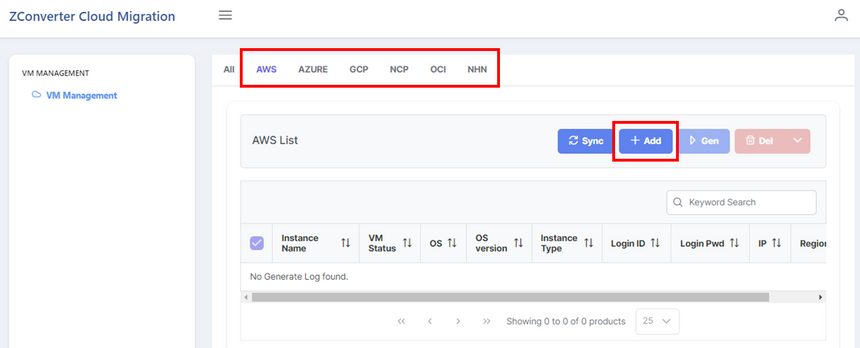

2. To register information of the VM, click `ADD`. 
    - **Text Field** : Enter the value in accordance with the constraints.

        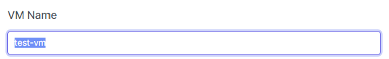

    - **Toggle List** : Select the value of the VM from each Toggle list.

        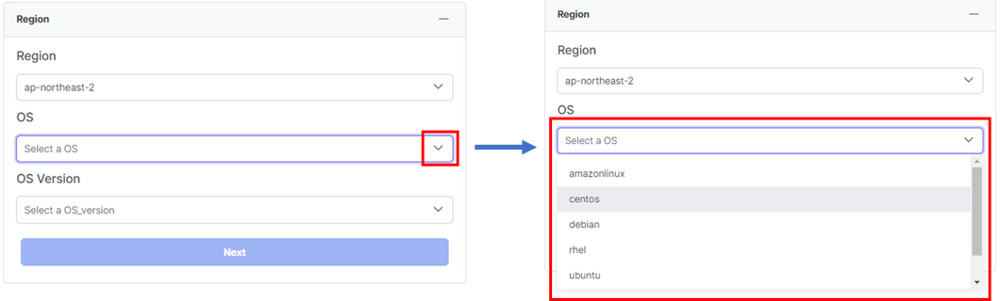

    - **Hide and Extend** : To hide or extend fields, click `+`.

        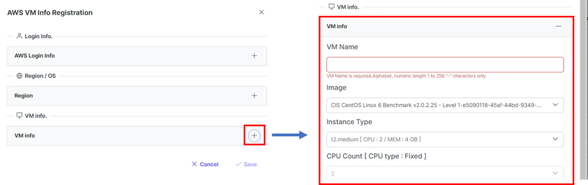

    - **Upload Files** 
        - Click `Choose` to select the file that you want to upload.

            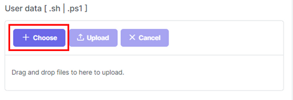

        - Click `Upload` to upload the file

            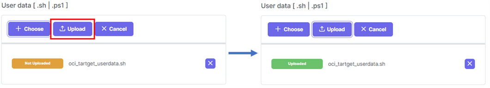        

        - Click `Cancel` to unload the file that you have uploaded.

            
&nbsp;
&nbsp;
## Notice / Precautions
A Target VM must contain **minimum 1 additional disk** and **each additional Disk's Size must be over 50(GB)**

&nbsp;
## Edit VM information
- By selecting each VM instance, you can check the details of each VM.

    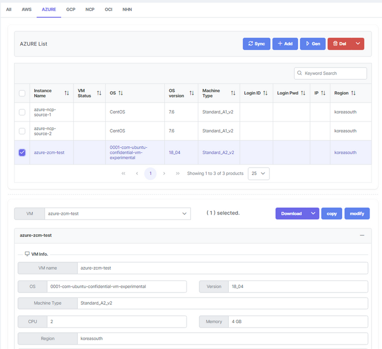

- To edit the values, click `Modify`. You can either click `Submit` to apply the changes, or click `cancel` to discard changes.
    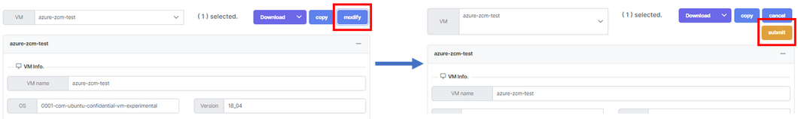
- By clicking `Copy`, you can duplicate the selected VM's information with "-[number]" added to the original name.

    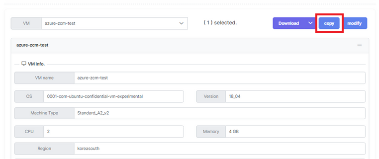

- You can download the VM's information into files by clicking `Download`.

    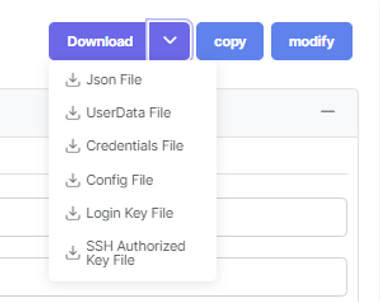

## 2) Generate VM
After you add all of the VMs' information, you can generate the VM instances. It takes 10-20 minutes for ZCM agent to be installed after VM's installation.

1. Select the VM information to be installed and click `Gen` to create the instance

    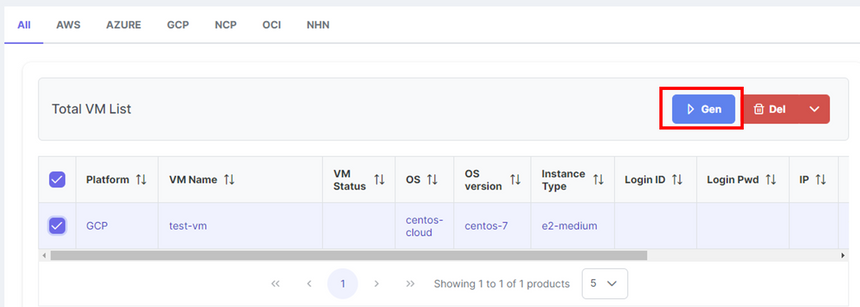

2. You can check the status of the VM via `VM Status`.

    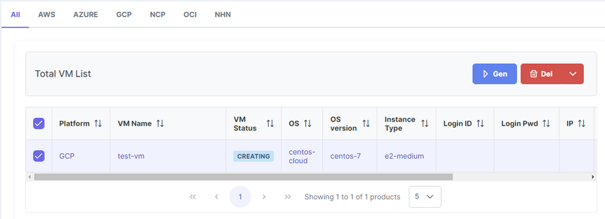

    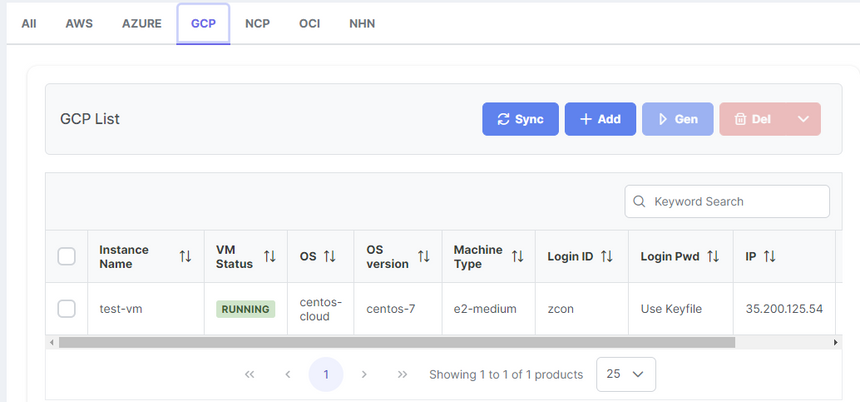

3. You can check the details of the VM installation via log file

    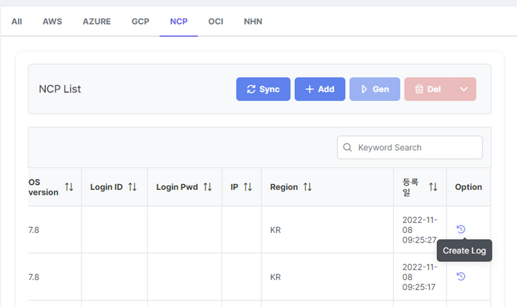
&nbsp;
&nbsp;
### 2) Generate VM 
After you add all of the VMs' information, you can generate the VM instances. It takes 10-20 minutes for ZCM agent to be installed after VM's installation.

1. Select the VM information to be installed and click `Gen` to create the instance

    

2. You can check the status of the VM via `VM Status`.

    

    

3. You can check the details of the VM installation via log file

    

## ZConverter Migration Demonstration
Premise : You have installed source/target agent with userdata files when generating VMs

1. Access [https://www.z-cloud.net/](https://www.z-cloud.net/) with a web browser and log in with an administrator account.
    
    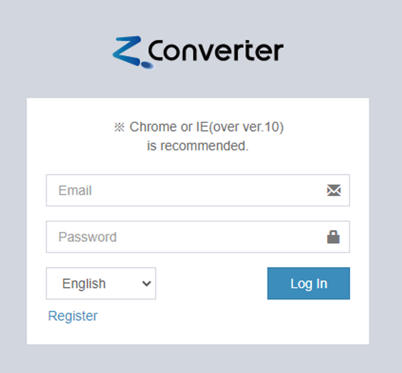

2. Move to the platform tab you want to migrate among the "Cloud Migration" tabs. 
    (Ex: in case of AWS -> OCI migration, move to OCI tab)

    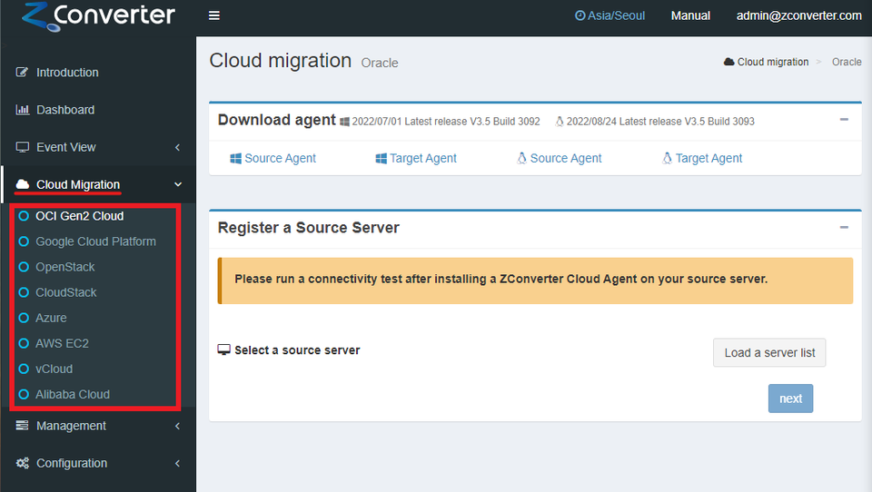

### Register source server
- Click the `Load a server list` button to bring the server where the source agent is installed to the list.

    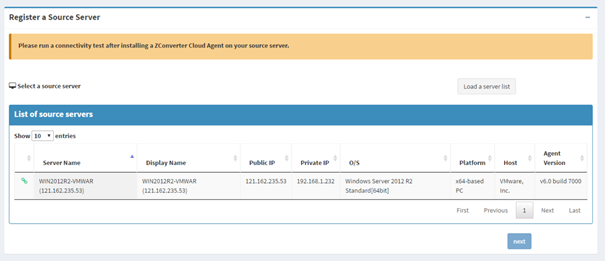
- Please check the connection status between the source server's agent and the ZConverter Cloud Management server through the leftmost icon in the server list. If the connection is disconnected, it is displayed as a red icon, and if the migration proceeds to this state, it may cause an error.

    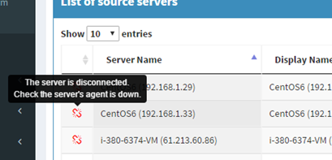

- Click on the server to migrate, and select a source server imaging method in the "Create or select a source image" panel.
    - "Create a new image" option: Select if you create and migrate a new image of the server.
    - "Use an listing image" option: Select if you are migrating an existing server image.

       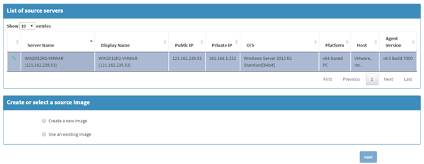

- Check the disk to be migrated.
- In the "Option" panel, select the type and path of the source image storage. (The source image storage is used to store the image of the source server.)
    - "Basic" type: Local type storage that is created within the source server and stores images.
        - We recommend creating a repository on a disk other than the disk to be migrated (when migrating Windows) or creating a repository in the root directory (when migrating Linux).
        - "Advanced" type: Storage on a remote server. You can select a storage or other network storage within the target server.
            - Select the `Target Repository` menu if you want to create a repository within the target server to store the source image.
- Click `next`.

    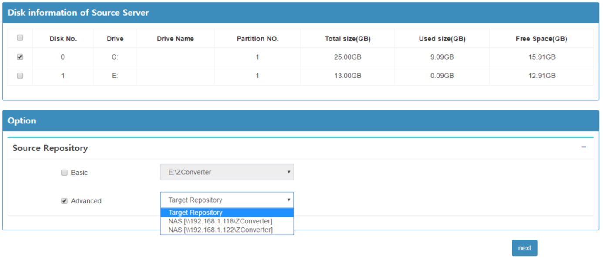
### Register target server 

- Click the `Load a server list` button to bring the server where the target agent is installed to the list.

    
- Please check the connection status between the target server's agent and the ZConverter Cloud Management server through the leftmost icon in the server list. If the connection is disconnected, it is displayed as a red icon, and if the migration proceeds to this state, it may cause an error.

    
       
- Click the migration target server in the target server list to retrieve disk information.
- Map the migration target disk of the source server to the "Mapping to the source server" item of the same disk drive as the migration target disk of the source server.

    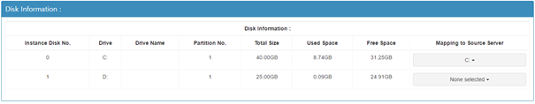
- In the "Target Repository" panel, select the type and path of the image repository.
    - "Basic" Type : Select this option when the source image repository is set to the "Basic" type or "Advanced" type "Target Repository" menu.
        - ※ The target repository must be created on a drive other than the drive mapped to the source server (Windows migration), or on the /ZConverter/ZConverter path (Linux migration).
    - "Advanced" type: Select this option if the source image store is set to "Advanced" type of network store (please select the same network store selected as the source image store). 

         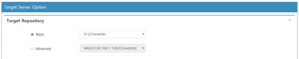       

- In the "Replication Option" panel, set the target server IP and port to which the source image is to be transmitted.
    - Target IP : Select the authorized IP of the target server (if not on the list, please press the "Add IP" button to add it).
    - Replication Port : Sets the port number to connect when sending the image (default: 50005).
- Set other migration options in the "Other Option" panel.
    - Hypervisor : Select the virtual device driver type for the cloud instance.
    - Kernel update : Check if you want to update the kernel version of the server. (When you migrate Linux)
    - Encryption (AES256) : Select if you want to apply data encryption during migration.
    - After job script : Register the script file to be executed after migration is completed. (Only .cmd or .sh files can be registered.)
- Click `next`.

    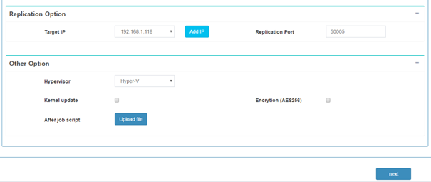       

- Press the `OK` button to start the migration.

     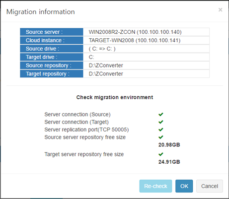 
- When the migration operation starts, it automatically goes to the "Monitoring Job" page.

      
                       

# Source VM/ Target VM Termination
Delete the Source and Target VMs used for migration validation. Connect to the Oracle Cloud console to stop ZCM_WEB VM so that it can be used again for customer meetings.

- Terminate Source/Target VM
    - Select the VM information that you want to delete and click `Delete` - `Delete installed VM`(생성된 VM 삭제)

        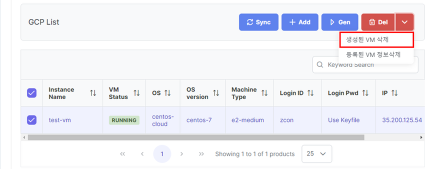 

        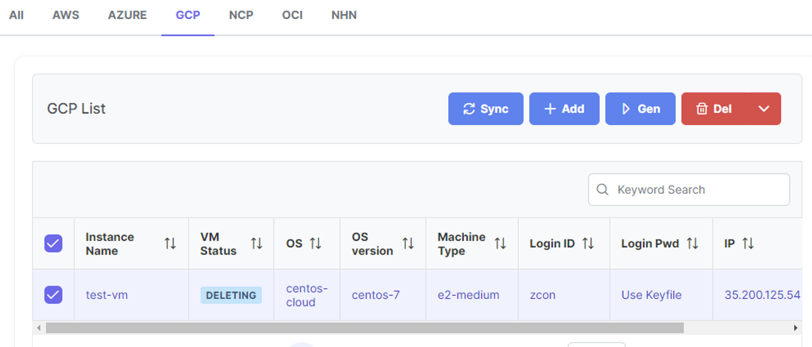 

    - (Optional) If you want to delete the registered VM information, click `Delete` - `Delete Registered VM information` (등록된 VM 정보 삭제)

        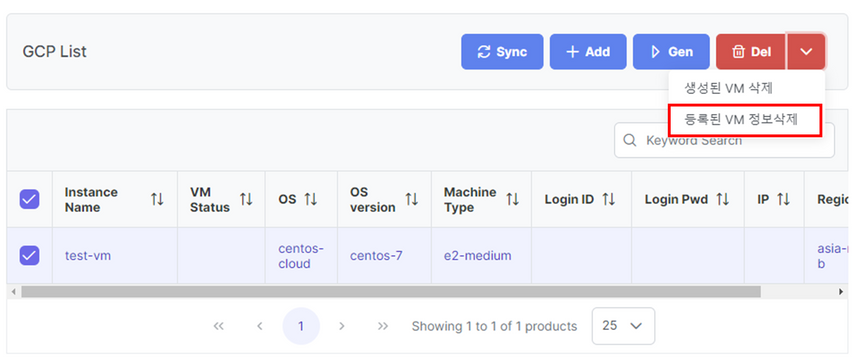 

- Stop ZCM_WEB Server
    - Connect to Oracle cloud and "STOP" ZCM_WEB VM instance. (NOT "Terminate")
