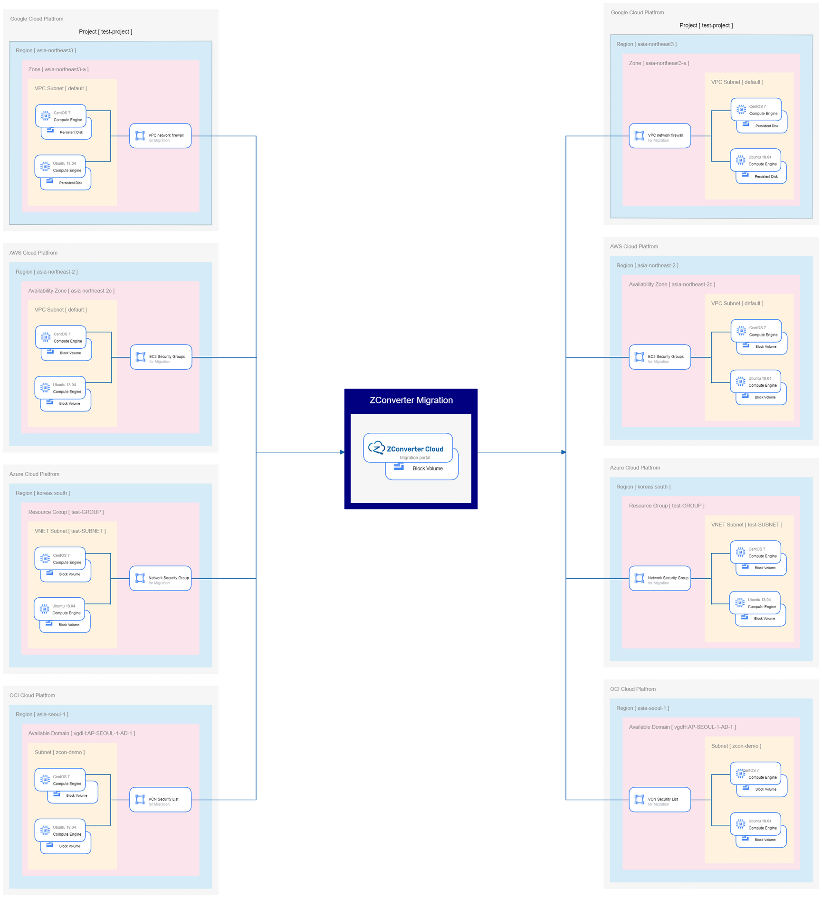

# ZCM-PoC-User-Guide



# table of contents
1. Prerequisites
2. Source VM/ Target VM installation
3. ZConverter Migration demonstration 
4. Source VM/ Target VM Termination

## 1. Prerequisites - Files 
1. Prepare files according to the client's requests such as files userData files, SSH files and etc. Refer to [Required files and values Section]() for details #edit-later 


2. Prepare API Keys for OCI CLI login. Refer to [How to
Generate an API Signing Key](https://docs.oracle.com/en-us/iaas/Content/API/Concepts/apisigningkey.htm) for details.


## 1. Prerequisites - Install ZCM_WEB VM 
1. Download `zcm_api_install.sh` from the following [link](https://www.zconverter.com/zm/zcm_api_install.sh)

2. Install ZCM_WEB Instances following the steps on this [github link](https://github.com/ZConverter-samples/terraform-oci-ansible-userdata)

    #### [ Requirements for ZCM_WEB VM ]
    &nbsp;Edit `./oci-ansible-server.oci_terraform_ansible_server.json` as listed below 
    ```
    provider : OCI API key value that was created on the previous step  
    vm_name : "ZCM_WEB”
    subnet_ocid : put the Subnet ID of ZCM WEB Server Instance - refer to Oracle Cloud Console
    user_data_file_path : move `ZCM_install_script.sh`to put the file path of write앞서 다운 받은 를 ./terraform-oci-ansible-userdata/oci-ansible-server/ 폴더에 저장한다. 
    “./ZCM_install_script.sh”로 변경한다.
    create_security_group_rules : 다음 블럭의 List of Security group rules를 복사해 붙여 넣는다.  
    ```
    #### [ List of Security Rules ]
    ```
    [
        {
            "direction" : "ingress",
            "ethertype" : "IPv4",
            "protocol" : "tcp",
            "port_range_max" : "22",
            "port_range_min" : "22",
            "remote_ip_prefix" : "0.0.0.0/0"
        },
        {
            "direction" : "ingress",
            "ethertype" : "IPv4",
            "protocol" : "tcp",
            "port_range_max" : "80",
            "port_range_min" : "80",
            "remote_ip_prefix" : "0.0.0.0/0"
        },
        {
            "direction" : "ingress",
            "ethertype" : "IPv4",
            "protocol" : "tcp",
            "port_range_max" : "111",
            "port_range_min" : "111",
            "remote_ip_prefix" : "0.0.0.0/0"
        },
        {
            "direction" : "ingress",
            "ethertype" : "IPv4",
            "protocol" : "tcp",
            "port_range_max" : "139",
            "port_range_min" : "139",
            "remote_ip_prefix" : "0.0.0.0/0"
        },
        {
            "direction" : "ingress",
            "ethertype" : "IPv4",
            "protocol" : "tcp",
            "port_range_max" : "445",
            "port_range_min" : "443",
            "remote_ip_prefix" : "0.0.0.0/0"
        },
        {
            "direction" : "ingress",
            "ethertype" : "IPv4",
            "protocol" : "tcp",
            "port_range_max" : "2049",
            "port_range_min" : "2049",
            "remote_ip_prefix" : "0.0.0.0/0"
        },
        {
            "direction" : "ingress",
            "ethertype" : "IPv4",
            "protocol" : "tcp",
            "port_range_max" : "3000",
            "port_range_min" : "3000",
            "remote_ip_prefix" : "0.0.0.0/0"
        },
        {
            "direction" : "ingress",
            "ethertype" : "IPv4",
            "protocol" : "tcp",
            "port_range_max" : "3306",
            "port_range_min" : "3306",
            "remote_ip_prefix" : "0.0.0.0/0"
        },
        {
            "direction" : "ingress",
            "ethertype" : "IPv4",
            "protocol" : "tcp",
            "port_range_min" : "3389",
            "port_range_max" : "3389",
            "remote_ip_prefix" : "0.0.0.0/0"
        },
        {
            "direction" : "ingress",
            "ethertype" : "IPv4",
            "protocol" : "tcp",
            "port_range_max" : "4001",
            "port_range_min" : "4001",
            "remote_ip_prefix" : "0.0.0.0/0"
        },
        {
            "direction" : "ingress",
            "ethertype" : "IPv4",
            "protocol" : "tcp",
            "port_range_max" : "5001",
            "port_range_min" : "5001",
            "remote_ip_prefix" : "0.0.0.0/0"
        },
        {
            "direction" : "ingress",
            "ethertype" : "IPv4",
            "protocol" : "tcp",
            "port_range_max" : "9054",
            "port_range_min" : "9051",
            "remote_ip_prefix" : "0.0.0.0/0"
        },
        {
            "direction" : "ingress",
            "ethertype" : "IPv4",
            "protocol" : "udp",
            "port_range_max" : "9054",
            "port_range_min" : "9051",
            "remote_ip_prefix" : "0.0.0.0/0"
        },
        {
            "direction" : "ingress",
            "ethertype" : "IPv4",
            "protocol" : "tcp",
            "port_range_min" : "50005",
            "port_range_max" : "50001",
            "remote_ip_prefix" : "0.0.0.0/0"
        },
        {
            "direction" : "ingress",
            "ethertype" : "IPv4",
            "protocol" : "icmp",
            "type" : "3",
            "code" : "4",
            "remote_ip_prefix" : "0.0.0.0/0"
        },
        {
            "direction" : "egress",
            "ethertype" : "IPv4",
            "protocol" : "udp",
            "port_range_min" : "33389",
            "port_range_max" : "33389",
            "remote_ip_prefix" : "0.0.0.0/0"
        },
        {
            "direction" : "egress",
            "ethertype" : "IPv4",
            "protocol" : "icmp",
            "type" : "3",
            "code" : "4",
            "remote_ip_prefix" : "0.0.0.0/0"
        },
        {
            "direction" : "egress",
            "ethertype" : "IPv4",
            "protocol" : "tcp",
            "port_range_min" : "22",
            "port_range_max" : "22",
            "remote_ip_prefix" : "0.0.0.0/0"
        },
        {
            "direction" : "egress",
            "ethertype" : "IPv4",
            "protocol" : "tcp",
            "port_range_min" : "445",
            "port_range_max" : "445",
            "remote_ip_prefix" : "0.0.0.0/0"
        },
        {
            "direction" : "egress",
            "ethertype" : "IPv4",
            "protocol" : "tcp",
            "port_range_min" : "139",
            "port_range_max" : "139",
            "remote_ip_prefix" : "0.0.0.0/0"
        },
        {
            "direction" : "egress",
            "ethertype" : "IPv4",
            "protocol" : "tcp",
            "port_range_min" : "5985",
            "port_range_max" : "5985",
            "remote_ip_prefix" : "0.0.0.0/0"
        }
    ]
    ```

3. Wait 10~20 minutes for the instance to operate 
4. Access the installed instance's public IP with port 4001


## 2. Source and Target 

