# ZCM-PoC-User-Guide


# table of contents
1. Prerequisites
2. Source VM/ Target VM installation
3. ZConverter Migration demonstration 
4. Source VM/ Target VM Termination

# Prerequisites 
This section covers prerequisites such as files, installation and etc. 
## Files 
1. Prepare files according to the client's requests such as files userData files, SSH files and etc. Refer to [Required files and values Section](./docs,files/Required-files-and-values.md) for details 


2. Prepare API Keys for OCI CLI login. Refer to [How to
Generate an API Signing Key](https://docs.oracle.com/en-us/iaas/Content/API/Concepts/apisigningkey.htm) for details.


## Install ZCM_WEB VM 
1. Download `zcm_api_install.sh` from the following [link](https://www.zconverter.com/zm/zcm_api_install.sh).

2. Install ZCM_WEB Instances following the steps on this [github link](https://github.com/ZConverter-samples/terraform-oci-ansible-userdata).

    #### [ Requirements for ZCM_WEB VM ]
    &nbsp;Edit `./oci-ansible-server.oci_terraform_ansible_server.json` as listed below* 
    
    (*plain text : follow the instructions, "" : write as it is, [] : name of a file/folder)
    ```
    provider : value of [OCI API key] that was created on the previous step  
    vm_name : "ZCM_WEB”
    subnet_ocid : value of the ocid of the Subnet of ZCM WEB Server Instance @ Oracle Cloud Console
    user_data_file_path : After moving [ZCM_install_script.sh] file to [./terraform-oci-ansible-userdata/oci-ansible-server/] folder, Write this value as "./ZCM_install_script.sh"
    create_security_group_rules : copy and paste the [security_rule.json] under `docs,files` folder
    ```

3. Wait 10~20 minutes for the instance to operate.
4. Access the installed instance's public IP with port 4001.


# Source and Target VM installation
This section covers how you can install the Source and the Target VM. you should **ADD** VM information first, and then **GEN**ERATE VM.
## 1) ADD VM information
1. Choose Cloud platform where you will install the VM.

    

2. To register information of the VM, click `ADD`. 
    - **Text Field** : Enter the value in accordance with the constraints.

        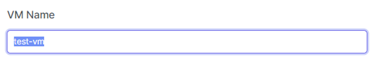

    - **Toggle List** : Select the region and the OS of the VM from each Toggle list.

        

    - **Hide and Extend** : To hide or extend fields, click `+`.

        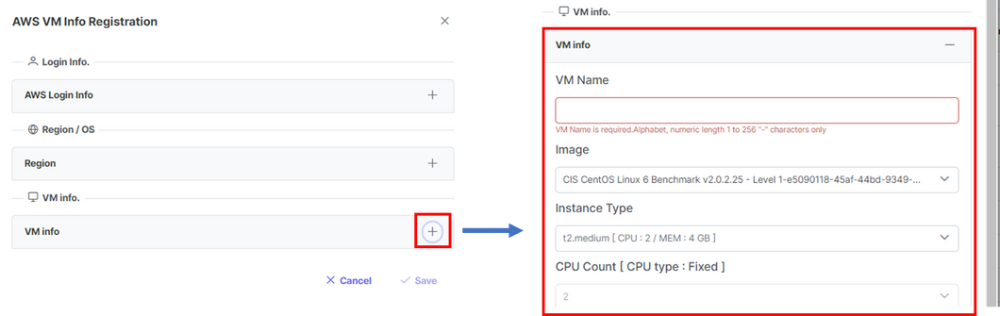

    - **Upload Files** 
        - Click `Choose` to select the file that you want to upload.

            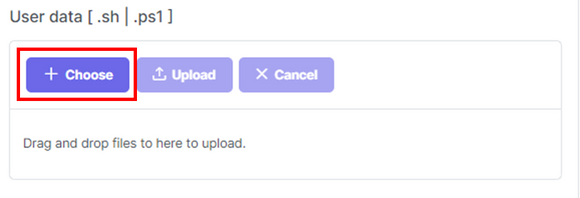

        - Click `Upload` to upload the file

                    

        - Click `Cancel` to unload the file that you have uploaded.

            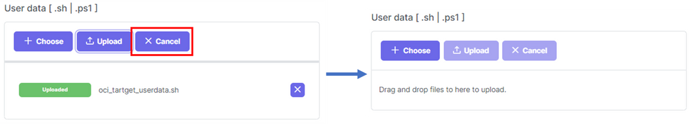
&nbsp;
&nbsp;
## Notice / Precautions
A Target VM must contain **minimum 1 additional disk** and **each additional Disk's Size must field must be over 50(GB)**

&nbsp;
## VM information example
To see examples of recommended values of each VM information field, refer to [VM-info-example](./docs,files/VM-info-example.md)

&nbsp;
## Edit VM information
- By selecting each VM instance, you can check the details of each VM.

    

- To edit the values, click `Modify`. You can either click `Submit` to apply the changes, or click `cancel` to discard changes.
    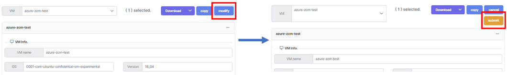
- By clicking `Copy`, you can duplicate the selected VM's information with "-1" added to the original name.

    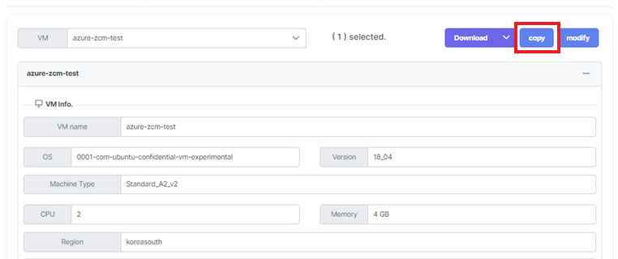

- You can download the VM's information into files by clicking `Download`.

    

## 2) Generate VM
After you add all of the VMs' information, you can generate the VM instances. It takes 10-20 minutes for ZCM agent to be installed after VM's installation.

1. Select the VM information to be installed and click `Gen` to create the instance

    

2. You can check the status of the VM via `VM status`.

    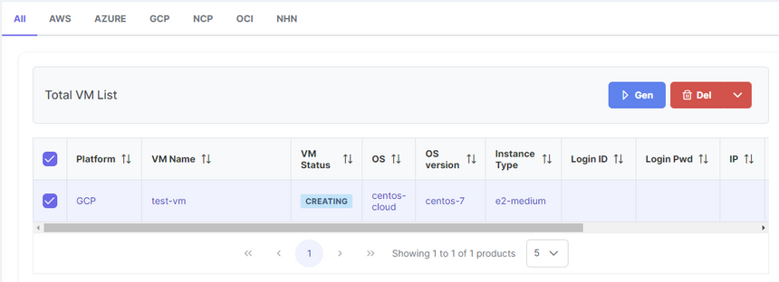

    

3. You can check the details of the VM installation via log file

    


# ZConverter Migration demonstration
After installing Source and Target VM installation and agent installation, access the `ZConverter Migration management portal` to proceed with the migration. 

1. Access [https://www.z-cloud.net/](https://www.z-cloud.net/) with a web browser and log in with an administrator account.
    
    

2. Move to the platform tab you want to migrate among the "Cloud Migration" tabs. 
    (Ex: in case of AWS -> OCI migration, move to OCI tab)

    

3. Install agent 
**IF source agent/target agent is installed already via user data, skip to step 4.**
    ### Source Agent
    - Download the Source Agent installation file corresponding to the source server's OS (Windows or Linux) from the "Download Agent" panel.

        
    
    - Windows : 
        - Remote access to the source server and copy the downloaded agent file to the Source source server    
        
        - After running the installation file, select the installation language and click OK
        

        - Click "Next"

            
        - Click "I Agree"

            
        - Click "Install"

            

        - When the settings window appears, enter or select the following information.
            - Connect option : Choose "Public ZConverter SaaS(http://www.z-cloud.net)"
            - Agent mode : "Source"
            - User Information : Enter the account information you are currently accessing.

                

    - Linux Server :
        - SSH access to the source server, and copy the downloaded agent installation file to the /tmp directory of the source server.
        - Proceed with the installation through the following command.

            
            
            ```
            cd /tmp
            tar zxvf ZConverter_CloudSourceClient_Setup_RedHat_x86_V3.0_Build_3005.tar.gz
            cd zconverter_install_source
            ```

        - ./install.sh command to proceed with the installation.
        - This is where the agent is to be installed. If you want to install it on a different path, enter that path. The default installation route is /ZConverteragent.

            
        - **This is the type selection of ZConverter Cloud Migration.
            - If you use Public ZCM, choose Item 1, and if you use Private ZCM, select Item 2 and enter the IP of that ZCM.**

                

        - This is the part where you enter the account of ZCM that you are currently using.

            

        - When the installation is complete as shown in the following screen, close the connection with the server and return to the z-cloud.net web portal.

            

            

    - Register a source server
        - Click the "Load a server list" button to bring the server where the source agent is installed to the list.

            

        - Please check the connection status between the source server's agent and the ZConverter Cloud Management server through the leftmost icon in the server list. If the connection is disconnected, it is displayed as a red icon, and if the migration proceeds to this state, it may cause an error.

            

       - Click on the server to migrate, and select a source server imaging method in the "Create or select a source image" panel.
            - "Create a new image" option: Select if you create and migrate a new image of the server.
            - "Use an listing image" option: Select if you are migrating an existing server image.
            
                

            - Check the disk to be migrated.
            - In the "Option" panel, select the type and path of the source image storage. (The source image storage is used to store the image of the source server.)
                - "Basic" type: Local type storage that is created within the source server and stores images.
                    - We recommend creating a repository on a disk other than the disk to be migrated (when migrating Windows) or creating a repository in the root directory (when migrating Linux).
                - "Advanced" type: Storage on a remote server. You can select a storage or other network storage within the target server.
                    - Select the "Target Repository" menu if you want to create a repository within the target server to store the source image.
            - Click "next".

                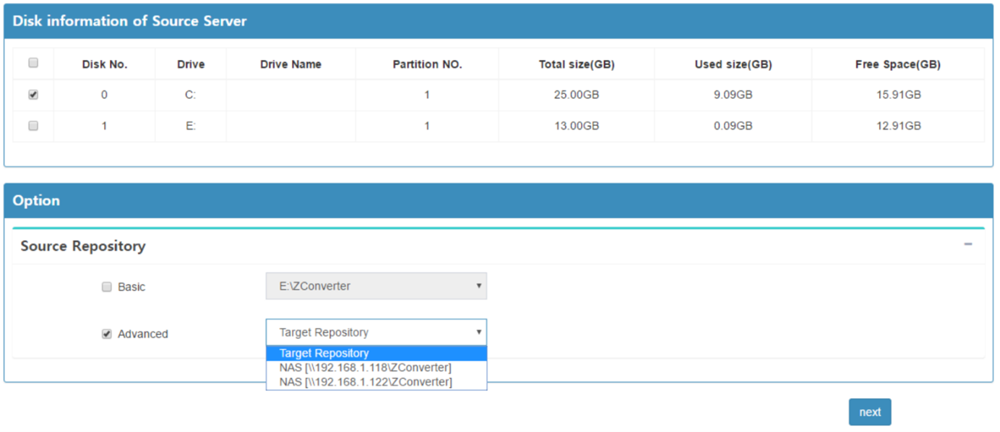

    ### Target Agent
    - Download the Target Agent installation file corresponding to the target server's OS (Windows or Linux) from the "Download Agent" panel at the top of the page.

        
    - Windows
        - The target agent installation procedure is the same as for source agent installation.
        - After remote access to the target instance, copy the downloaded agent installation file to the target instance. The subsequent installation procedure proceeds the same as the second process of "How to use ZConverter Cloud Migration."
    - Linux Server
        - SSH access to the target server and copy the downloaded agent installation file to the /tmp directory of the target server.
        - Proceed with the installation through the following command.

            

            ```
            cd /tmp
            tar zxvf ZConverter\_CloudTargetClient\_Setup\_RedHat\_x86\_V3.0\_Build\_3005.tar.gz
            #(The file name may be different. Please enter the exact file name of the downloaded agent installation file.)
            cd zconverter\_install\_target
            ```
        - Enter the ./install.sh command to proceed with the installation.
        - This is where the agent is to be installed. If you want to install it on a different path, enter that path. The default installation route is /ZConverteragent.
        
            
        - This is the type selection of ZConverter Cloud Migration. If you use Public ZCM, choose Item 1, and if you use Private ZCM, select Item 2 and enter the IP of that ZCM.
        
            

        - This is the part where you enter the account of ZCM that you are currently using.

            

        - When the installation is complete as shown in the following screen, close the connection with the server and return to the z-cloud.net web portal.

            

            

        - Register a target server
            - Click the "Load a server list" button to bring the server where the target agent is installed to the list.

                

            - Please check the connection status between the target server's agent and the ZConverter Cloud Management server through the leftmost icon in the server list. If the connection is disconnected, it is displayed as a red icon, and if the migration proceeds to this state, it may cause an error.

                
                
            - Click the migration target server in the target server list to retrieve disk information.
            - Map the migration target disk of the source server to the "Mapping to the source server" item of the same disk drive as the migration target disk of the source server.

                
            - In the "Target Repository" panel, select the type and path of the image repository.
                - "Basic" Type : Select this option when the source image repository is set to the "Basic" type or "Advanced" type "Target Repository" menu.
                    - ※ The target repository must be created on a drive other than the drive mapped to the source server (Windows migration), or on the /ZConverter/ZConverter path (Linux migration).
                - "Advanced" type: Select this option if the source image store is set to "Advanced" type of network store (please select the same network store selected as the source image store).    

                           
            
            - In the "Replication Option" panel, set the target server IP and port to which the source image is to be transmitted.
                - Target IP : Select the authorized IP of the target server (if not on the list, please press the "Add IP" button to add it).
                - Replication Port : Sets the port number to connect when sending the image (default: 50005).
            - Set other migration options in the "Other Option" panel.
                - Hypervisor : Select the virtual device driver type for the cloud instance.
                - Kernel update : Check if you want to update the kernel version of the server. (When you migrate Linux)
                - Encryption (AES256) : Select if you want to apply data encryption during migration.
                - After job script : Register the script file to be executed after migration is completed. (Only .cmd or .sh files can be registered.)
            - Click "next".

                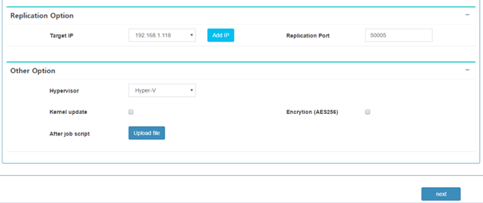       
            
            - Press the "OK" button to start the migration.

                 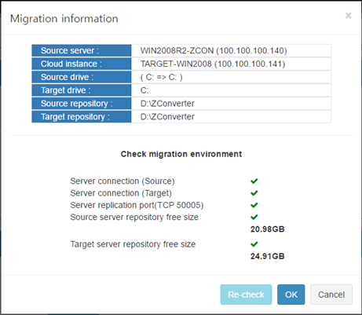 

            - When the migration operation starts, it automatically goes to the "Monitoring Job" page.

                  
                       

# Source VM/ Target VM Termination
Delete the Source and Target VMs used for migration validation. Connect to the cloud console to stop ZCM_WEB VM so that it can be used again for customer meetings.


- Terminate Source/Target VM
    - Select the VM information you want to delete and click `Delete` - `Delete installed VM`(생성된 VM 삭제)

        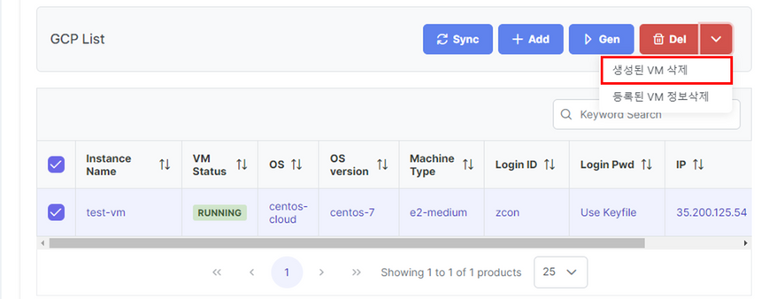 

        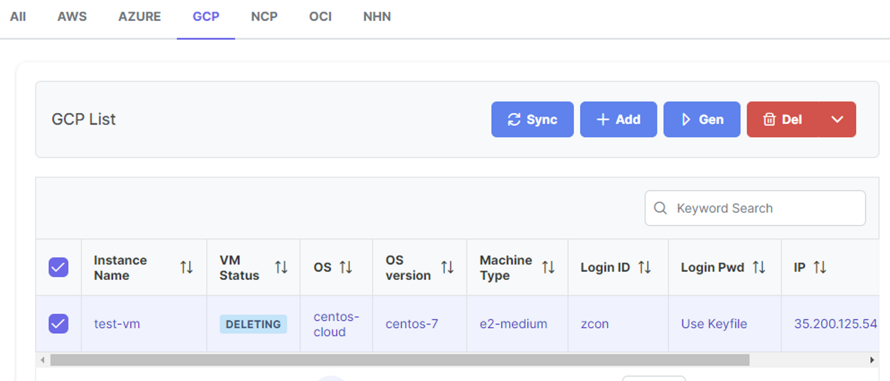 

    - (Optional) If you want to delete the registered VM information, click `Delete` - `Delete Registered VM information` (등록된 VM 정보 삭제)

         

- Stop ZCM_WEB Server
    - Connect to Oracle cloud and "STOP" ZCM_WEB VM instance. (NOT "Terminate")