# Required files and values Cloud platform

1. AWS  
2. Azure
3. OCI  
4. GCP  
5. NCP  

# 1. AWS

## 1-1. Prerequisites

1. **Authorizing for CLI**
    
    To authorize AWS CLI, you need Access key, Secret Access key. For more information, see: [**Managing Access Keys for IAM Users**](https://docs.aws.amazon.com/ko_kr/IAM/latest/UserGuide/id_credentials_access-keys.html#access-keys_required-permissions)
    
    1. Go to **IAM > User** page in the AWS console. 
    2. Choose an existing user or create a new one.  
        
        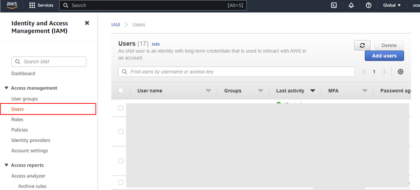 

        
    3. Go to **Security Credentials** menu.
    4.  Click `Create access key`.
        
        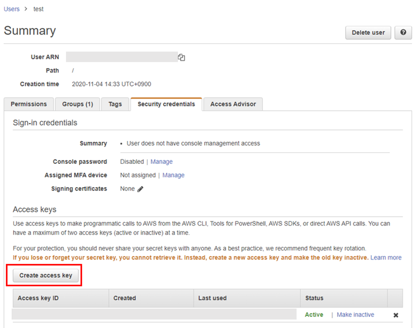 
        

1. **SSH Key file**
    
    If you want to connect VMs using third party tools or OpenSSH, you need a SSH key pair. For more information, see: [**Create EC2 SSH Key pair**](https://docs.aws.amazon.com/ground-station/latest/ug/create-ec2-ssh-key-pair.html)
    
    1. Go to **EC2 > Network&Security > Key Pairs** page in AWS console 
    2. Create new SSH key pair:
        1. Click `Create Key pair`
        2. Specify the following:
            - **Key pair type:** RSA
            - **Private key file format**: ****.pem
        3. Click `Create key pair`. The private key file (.pem) will be downloaded to your local system.
            
            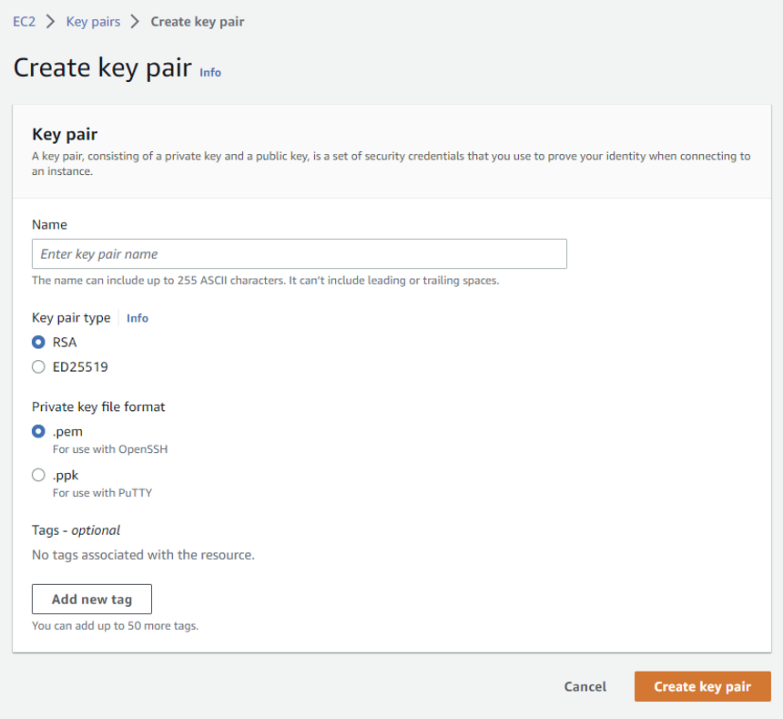 
            
    3. **(optional)** Create a private key file to connect Linux VMs by using **PuTTYGen**
        1. Open **PuTTYGen**.
        2. Click `Import key` under **Conversion** menu. Import the private key file (.pem) created in the previous step. 
            
            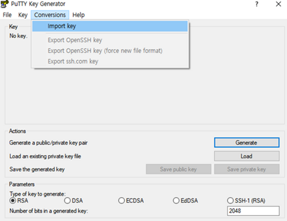 
            
        3. Click `Save private key` to save PPK key file. The private key file (.ppk) will be downloaded to your local system.
            
            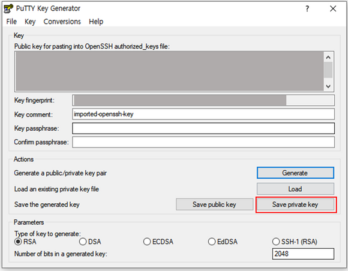 
            

1. **Security Group for ZCM**
    
    For ZCM migration, you need to prepare a Security Group. 
    
    If you select `Automatically create a new security group` when add VM Info from ZConverter console, the security group is automatically created with the following rules:
    
    ```bash
    [
        {
            "protocol": "tcp",
            "from": 22,
            "to": 22,
            "source": "218.145.116.162/32"
        },
        {
            "protocol": "tcp",
            "from": 3389,
            "to": 3389,
            "source": "218.145.116.162/32"
        },
        {
            "protocol": "tcp",
            "from": 3306,
            "to": 3306,
            "source": "218.145.116.162/32"
        },
        {
            "protocol": "tcp",
            "from": 80,
            "to": 80,
            "source": "0.0.0.0/0"
        },
        {
            "protocol": "tcp",
            "from": 111,
            "to": 111,
            "source": "0.0.0.0/0"
        },
        {
            "protocol": "tcp",
            "from": 139,
            "to": 139,
            "source": "0.0.0.0/0"
        },
        {
            "protocol": "tcp",
            "from": 443,
            "to": 445,
            "source": "0.0.0.0/0"
        },
        {
            "protocol": "tcp",
            "from": 2049,
            "to": 2049,
            "source": "0.0.0.0/0"
        },
        {
            "protocol": "tcp",
            "from": 3000,
            "to": 3000,
            "source": "0.0.0.0/0"
        },
        {
            "protocol": "tcp",
            "from": 4001,
            "to": 4001,
            "source": "0.0.0.0/0"
        },
        {
            "protocol": "tcp",
            "from": 5001,
            "to": 5005,
            "source": "0.0.0.0/0"
        },
        {
            "protocol": "tcp",
            "from": 9051,
            "to": 9054,
            "source": "0.0.0.0/0"
        },
        {
            "protocol": "tcp",
            "from": 50000,
            "to": 50005,
            "source": "0.0.0.0/0"
        },
        {
            "protocol": "tcp",
            "from": 53306,
            "to": 53306,
            "source": "0.0.0.0/0"
        },
        {
            "protocol": "icmp",
            "from": -1,
            "to": -1,
            "source": "0.0.0.0/0"
        }
    ]
    ```
    

## 1-2. VM Info Fields

1. **Profile** *essential
    
    A profile for your credential information about AWS CLI. Allowed characters are letter, numbers, under bar(_), and hypen(-).
    
2. **Access Key** *essential
    
    An access key you created in AWS console.
    
3. **Secret Access Key** *essential
    
    An secret access key you created in AWS console.
    
4. **Login Region** *essential
    
    A region used for authorizing AWS CLI.
    
5. **Region** *essential
    
    A region in which you want to create the VM.
    
6. **OS** *essential
    
    The Operating System used for the VM.
    
7. **OS_Version** *essential
    
    The versioin of Operating System used for the VM. 
    
8. **VM Name** *essential
    
    A name of the VM. Although it doesn’t have to be unique, using the same name is not recommended. For more information, see: [**Tag naming and Usage conventions**](https://docs.aws.amazon.com/mediaconnect/latest/ug/tagging-restrictions.html)
    
    ```
    The value must be between 1 ~ 256 characters long. Allowed characters are English letters, numbers, spaces representable in UTF-8, and the following characters: 
    		. : + = @ _ / - (hyphen)
    ```
    
9. **Image** *essential
    
    The AMI used for the VM installation. You can select an AMI from toggle list. which contains all AMI images provieded by AWS, user community, the AWS Marketplace or your own AMIs.
    
    **[ Available AMI’s ID of ZConverter account ]**
    
    | OS | OS_version | AMI ID |
    | --- | --- | --- |
    | amazonlinux | 414 | ami-06eb68a3c20079122 |
    | amazonlinux | 510 | ami-0788ebab0673d1f8f |
    | CentOS | 6 | ami-03ee336d |
    | CentOS | 7 | ami-09e2a570cb404b37e |
    | Ubuntu | 14.04 | ami-7e11b810 |
    | Ubuntu | 16.04 | ami-06a18c6eeba897ffb |
    | Ubuntu | 18.04 | ami-0577415d1b9ca972b |
    | debian | 10 | ami-0e26f975b4332d545 |
    | debian | 11 | ami-03d9cb7004f0eee88 |
    | rhel | 6 | ami-0917397b0a1c17cdd |
    | rhel | 7 | ami-08a24b6a40691f3b1 |
    | rhel | 8 | ami-0fe9cfeb138b4030b |
    | Windows | 2012r2 |  |
    | Windows | 2016 |  |
    
    *It can be updated.
    
10. **Instance Type** *essential 
    
    The instance type used for the VM.
    
11. ****CPU Count [ CPU type : Fixed/Flexible ]**** *optional
    
    The number of CPUs of the selected instance type. If the instance type is flexible, you can change the number of CPUs. 
    
12. ****Memory Size [ Memory type : Fixed ]**** *optional
    
    A size of memory for the selected instance type. 
    
13. **Security Group Id** *optional
    
    A security group ID used for the VM.  There are two options: 
    
    - `Automatically create a new security group`: Create a new security group.
    - `Use existing security group`: Use one of the existing security groups.
14. **Login Key [ .pem ]** *optional
    
    A public key of the key pair to access the VM. You can create a new one in AWS console. Or, if you use a third-party tool to create your key pairs, you must import the public key to AWS console. For more information, see: [**Create EC2 SSH Key pair**](https://docs.aws.amazon.com/ground-station/latest/ug/create-ec2-ssh-key-pair.html)
    
15. **Volume** *optional
    
    List of the sizes of block volumes. If you want to attach one or more volumes to the VM, list sizes with comma(,). Size must be between 1 ~ 16,384 GB, a multiple number of 1 GB. These volumes are automatically deleted when the VM is terminated.
    
    ```
    Ex)  Attach two persistent disks (50GB) to VM
    		50,50
    ```
    
16. **User data [ .sh | .cmd ]** *optional
    
    An user data that run when the instance boots. On Linux VMs, use bash file (.sh). On Windows VMs, use powershell file (.ps1). User data is limited to 16 KB.
    

---

# 2. Azure

## 2-1. Prerequisites.

1. Authorizing for CLI
    
    To authorize Azure CLI, you need Subscription ID, Tenant ID, Application ID and password (client secret). For more information, see: [**How to Create Service Principal in Portal**](https://learn.microsoft.com/ko-kr/azure/active-directory/develop/howto-create-service-principal-portal)
    
    1. Go to **Subscriptions** page in Azure console.
    2. Copy the subscription ID you want to use. 
    3. Go to **Azure Active Directory > App registrations** page.
    4. Choose an application on the list or create a new one by selecting `New registration`. 
        
        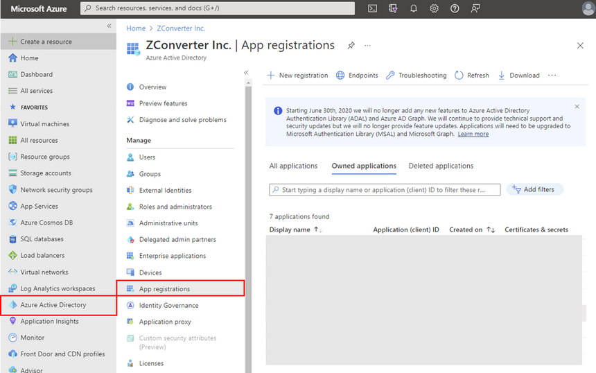 
        
    5. Copy and save the Directory (tenant) ID and the Application ID. 
        
       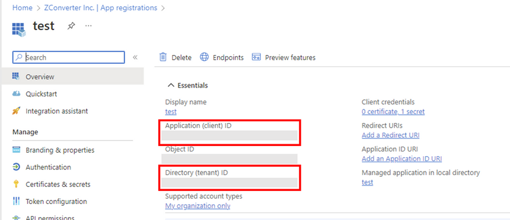 
        
    6. Create new Application password (client secret):
        1. Go to **Certificates & secrets > Client secrets** page.
        2. Click `New client secret`.
            
            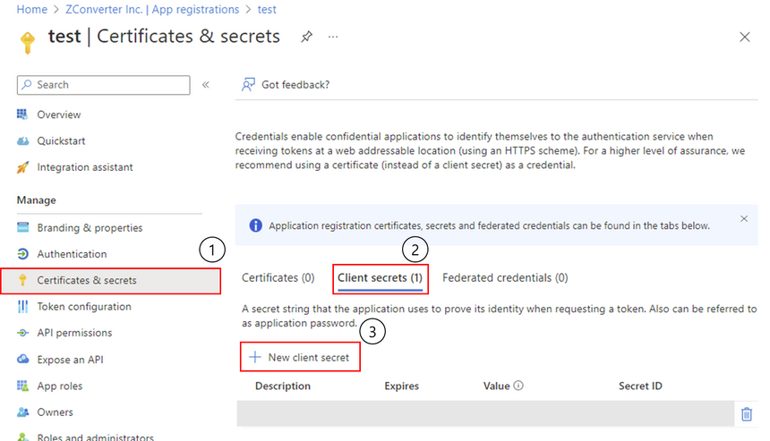 
            
        3. Enter information for the secret and click `Add`.
        4. After creating the secret is done, copy and save the value of the secret. Because the value is displayed, you won’t be able to retrieve the key later. 
            
            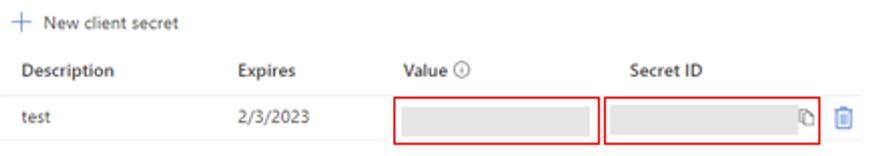 
            
    

## 2-2. VM Info Fields

1. ****Subscription ID****  *essential
    
    A subscription ID used to create and manage Azure resources. 
    
2. ****Tenant ID****  *essential
    
    A ID of the active directory (tenant) used for authorizing Azure CLI.  
    
3. ****App ID****  *essential
    
    A ID of the application used for authorizing Azure CLI
    
4. ****App PWD (client secret)****  *essential
    
    A password of the application used for authorizing Azure CLI
    
5. ****Region****  *essential
    
    A region in which you want to create the VM. 
    
6. ****VM Name**** *essential
    
    A name of the VM. Name must be unique. For more information, see: [**Resource Naming Rules**](https://learn.microsoft.com/en-us/azure/azure-resource-manager/management/resource-name-rules)
    
    ```
    The maximum length is 64 characters for Linux VMs and 15 characters for Windows VMs. 
    Name can’t end with hyphen. Can't use spaces, control characters, or these characters:
    		~ ! @ # $ % ^ & * ( ) = + _ [ ] { } \ | ; : . ' " , < > / ?
    ```
    
7. ****Machine Type****  *essential
    
    The machine type used for the VM. 
    
8. ****CPU Count [ type : Fixed ]**** *optional
    
    The number of CPUs of the selected machine type.
    
9. **Memory Size [ type : Fixed ]** *optional
    
    A size of memory for the selected machine type.
    
10. ****OS****  *essential
    
    The Operating System used for the VM.
    
11. ****OS_version****  *essential
    
    The version of Operating System used for the VM.  
    
12. ****Volume**** *optional
    
    List of the sizes for additional disks. If you want to attach one or more disks to the VM, list sizes with comma(,). Size must be between 1 ~ 32,767 GB, a multiple number of 1 GB. 
    
    ```bash
    You will be charged the same rate for your provisioned disk, regardless of how much of the disk space is being used.
    Ex)  Attach two additional disks (50GB) to VM
    		50,50
    ```
    
13. ****Username (Login ID)****  *essential
    
    The administrator username for the VM.
    
    ```bash
    Username must only contain English letters, numbers, hyphens, and underscores and may not start with a hyphen or number.
    The value must be between 1 ~ 64 characters long. Usernames must not include reserved words. (ex) test, root, admin, ...) 
    ```
    
14. ****Password (Login Password)****  *essential
    
    The administrator password for the VM.
    
    ```bash
    Password must have 3 of the following: 1 lowercase character, 1 uppercase character, 1 number and 1 special character
    The value must be between 12 ~ 72 characters long.
    ```
    
15. ****User data [ .sh | .ps1 ]**** *optional
    
    An user data that run when the instance boots. On Linux VMs, use bash file (.sh). On Windows VMs, use powershell file (.ps1).
    

---

# 3. OCI

## 3-1. Prerequisites

1. **Authorizing for CLI**
    
    To authorize Oracle Cloud CLI, you need an API key pair. For more information, see: [**How to Generate an API Signing Key**](https://docs.oracle.com/en-us/iaas/Content/API/Concepts/apisigningkey.htm)
    
    1. Go to **Identity & Security > User** page in Oracle Cloud console**.** 
    2. Choose an existing user or ****create a new one.  ****
    3. Go to **API Keys** page.
        
        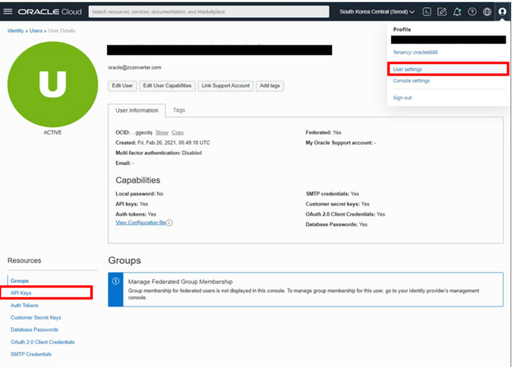 
        
    4. Click **`Add API Key`** to create a new key pair. 
        
        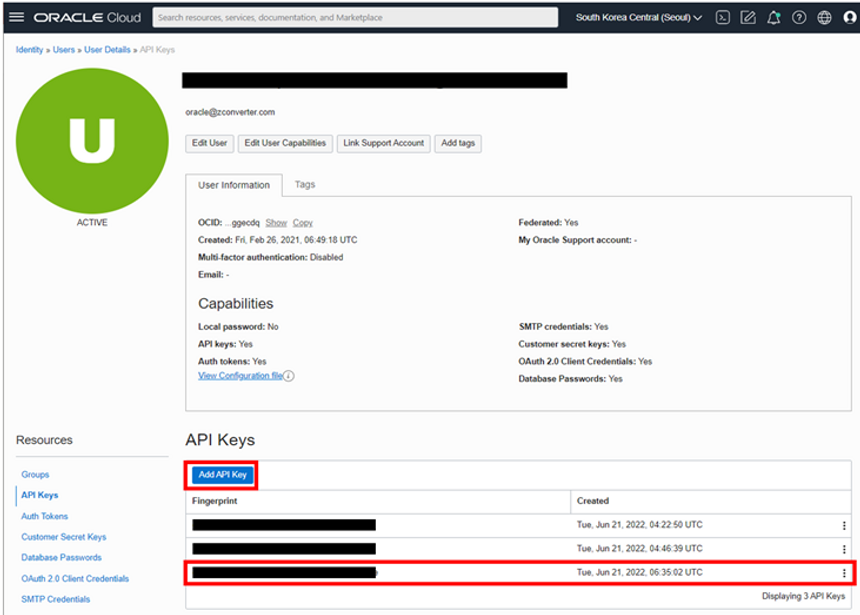 
        
    5. After creating, click `Download Private Key`. The private key (.pem) will be downloaded to your local system.  
    6. Click `Add`.
    7. Copy the text from the **Configuration File Preview** field. Then, save the copied value in your configuration file. 
        
        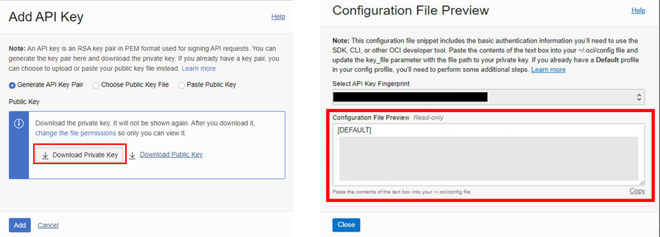 
        
    
2. **SSH Key file**
    
    If you want to connect VMs using third party tools or OpenSSH, you need a SSH key pair.
    
    1. Open **PuTTYGen**. 
    2. Specify **Parameter** field**:** 
        - **Type of key to generate**: RSA
        - **Number of bits in a generated key**: `2048` or more
    3. Click `Generate`.
    4. Copy the text from the **Public key for pasting into OpenSSH authorized_keys file** field. Then, save the copied value as Public key file (.pub).

1. **Subnet for ZCM** 
    
    For ZCM migration, you need to prepare a Subnet.
    
    If you select `Automatically create a new subnet` when add VM Info from ZConverter console, the subnet is automatically created with the follwoing rules:  
    
    ```bash
    IN_RULE = [
      {
        "icmpOptions": {
          "code": 4,
          "type": 3
        },
        "isStateless": False,
        "protocol": "1",
        "source": "0.0.0.0/0"
      },
      {
        "icmpOptions": {
          "type": 3
        },
        "isStateless": False,
        "protocol": "1",
        "source": "10.0.0.0/16"
      },
      {
        "source": "218.145.116.162/32",
        "protocol": "6",
        "isStateless": True,
        "tcpOptions": {
          "destinationPortRange": {
            "max": 22,
            "min": 22
          }
        }
      },
      {
        "source": "218.145.116.162/32",
        "protocol": "6",
        "isStateless": True,
        "tcpOptions": {
          "destinationPortRange": {
            "max": 3389,
            "min": 3389
          }
        }
      },
      {
        "source": "218.145.116.162/32",
        "protocol": "6",
        "isStateless": True,
        "tcpOptions": {
          "destinationPortRange": {
            "max": 3306,
            "min": 3306
          }
        }
      },
      {
        "source": "0.0.0.0/0",
        "protocol": "6",
        "isStateless": True,
        "tcpOptions": {
          "destinationPortRange": {
            "max": 9054,
            "min": 9051
          }
        }
      },
      {
        "source": "0.0.0.0/0",
        "protocol": "17",
        "isStateless": True,
        "udpOptions": {
          "destinationPortRange": {
            "max": 9054,
            "min": 9051
          }
        }
      },
      {
        "source": "0.0.0.0/0",
        "protocol": "6",
        "isStateless": True,
        "tcpOptions": {
          "destinationPortRange": {
            "max": 50005,
            "min": 50000
          }
        }
      },
      {
        "source": "0.0.0.0/0",
        "protocol": "6",
        "isStateless": True,
        "tcpOptions": {
          "destinationPortRange": {
            "max": 80,
            "min": 80
          }
        }
      },
      {
        "source": "0.0.0.0/0",
        "protocol": "6",
        "isStateless": True,
        "tcpOptions": {
          "destinationPortRange": {
            "max": 53306,
            "min": 53306
          }
        }
      },
      {
        "source": "0.0.0.0/0",
        "protocol": "6",
        "isStateless": True,
        "tcpOptions": {
          "destinationPortRange": {
            "max": 139,
            "min": 139
          }
        }
      },
      {
        "source": "0.0.0.0/0",
        "protocol": "6",
        "isStateless": True,
        "tcpOptions": {
          "destinationPortRange": {
            "max": 445,
            "min": 443
          }
        }
      },
      {
        "source": "0.0.0.0/0",
        "protocol": "6",
        "isStateless": True,
        "tcpOptions": {
          "destinationPortRange": {
            "max": 111,
            "min": 111
          }
        }
      },
      {
        "source": "0.0.0.0/0",
        "protocol": "6",
        "isStateless": True,
        "tcpOptions": {
          "destinationPortRange": {
            "max": 2049,
            "min": 2049
          }
        }
      },
      {
        "source": "0.0.0.0/0",
        "protocol": "6",
        "isStateless": True,
        "tcpOptions": {
          "destinationPortRange": {
            "max": 4001,
            "min": 4001
          }
        }
      },
      {
        "source": "0.0.0.0/0",
        "protocol": "6",
        "isStateless": True,
        "tcpOptions": {
          "destinationPortRange": {
            "max": 5005,
            "min": 5000
          }
        }
      },
      {
        "source": "0.0.0.0/0",
        "protocol": "6",
        "isStateless": True,
        "tcpOptions": {
          "destinationPortRange": {
            "max": 3000,
            "min": 3000
          }
        }
      }
    ]
    
    EG_RULE = [
        {
            "destination": "0.0.0.0/0",
            "protocol": "all",
            "isStateless": False
        }
    ]
    ```
    

## 3-2. VM Info field

1. **Credentials File Upload [ Config File ]** *essential
    
    A configuration file of User API key. 
    
2. **Config Key File [ .pem ]** *essential
    
    A private key (.pem) of User API key. 
    
3. **Compartment Id** *essential
    
    A Compartment ID in which you want to create the VM.
    
4. **Available Domain** *essential
    
    An available domain in which you want to create the VM.  
    
5. **VM Name** *essential
    
    A name of the VM. Although it doesn’t have to be unique, using the same name is not recommended. The value must be between 1 ~ 255 characters long. Allowed characters are English letters, numbers, hypen (-).
    
6. **Profile** *essential
    
    A profile for the key value in your configuration file. If there are multiple values in the configuration file, you must specify the profile.   
    
7. **Machine Type [ Shape ]** *essential
    
    A machine type used for the VM. 
    
8. **CPU Count [ CPU type ]** *optional
    
    The number of CPUs of the selected machine type. If the machine type is flexible, you can change the number of CPUs. Depending on the machine type, you must specify a valid number of CPUs as a multiple number of 1. 
    
9. **Memory Size [ Memory type ]** *optional
    
    The size of memory of the selected machine type. The amount of memory allowed depends on the machine type. In case of the `Flexible` type, you can change the size of memory where you must specify a valid size of memory as a multiple number of 1.
    
10. **OS** *essential
    
    The Operating System used for the VM.  
    
11. **OS_Version** *essential
    
    The version of Operating System used for the VM. 
    
    ```
    Windows Datacenter versions are not recommended, because they are only supported on Bare Metal machine. 
    ```
    
12. **Subnet Id** *essential
    
    The subnet used for the VM. There are two options:  
    
    - `Automatically create a new subnet` : Create a new Subnet in the specified compartment.
    - `Use existing subnet` : Use one of the existing subnets in the specified compartment.
13. **Login key [ .pub ]** *optional
    
    A public key (.pub) of the SSH key pair to access the VM. 
    
14. **Volume** *optional
    
    List of the sizes of additional block volumes. If you want to attach one or more volumes to the VM, list sizes with comma(,). Size must be between 50 ~ 16,384 GB, a multiple number of 1 GB.
    
    ```bash
    Ex)  Attach two additional volumes (50GB) to VM
    		50,50
    ```
    
15. **User data [ .sh | .cmd ]** *optional
    
    An user data that run when the instance is launched. On Linux VMs, use bash file (.sh). On Windows VMs, use powershell file (.ps1)
    

---

# 4. GCP

## 4-1. Prerequisites

1. **Authorizing for CLI**
    
    To authorize Google Cloud CLI, you need a Service Account credentials (API Key). For more information, see: [Authorizing the gcloud CLI](https://cloud.google.com/sdk/docs/authorizing)
    
    1. Go to **IAM&Admin > Sevice Account** page in the Google Cloud console  
        
        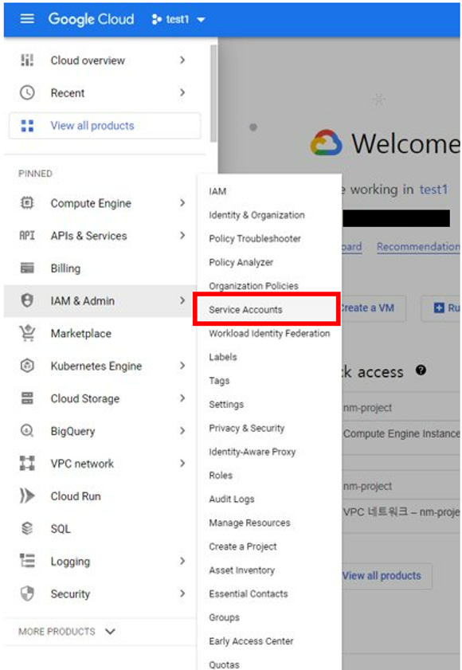 
        
    2. Choose an existing account on the list or create a new one by clicking `Create service account`**.**
        
        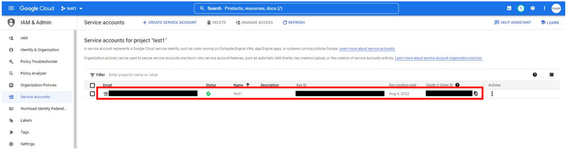 
        
    3. Create new JSON-formatted key file: 
        1. Click `KEYS`. 
        2. Click `ADD KEY` drop down menu.
            
            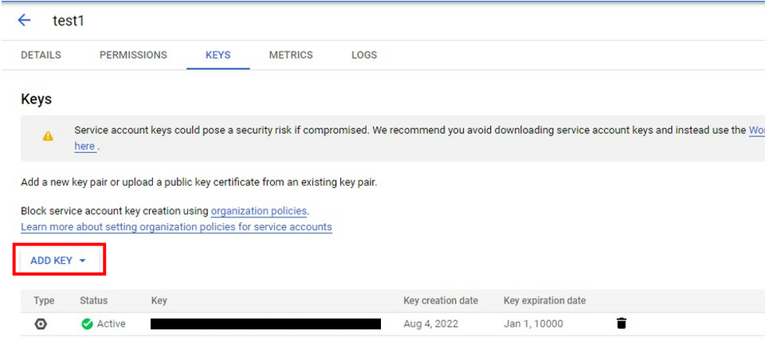 
            
        3. Click `Create new key`.
        4. Select a key format **JSON** and then click `Create` (It will be downloaded to your local system)
            
            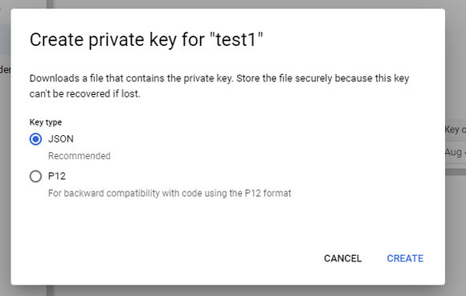 
            

1. **SSH Key file**
    
    If you want to connect VMs using third party tools or OpenSSH, you need a SSH key pair. For more information, see: [Create an SSH key pair](https://cloud.google.com/compute/docs/connect/create-ssh-keys)
    
    1. Open **PuTTYGen.** 
    2. Specify **Parameter** field**:** 
        - **Type of key to generate**: RSA
        - **Number of bits in a generated key**: `2048` or more
    3. Click `Generate`. 
    4. Copy the text from the **Public key for pasting into OpenSSH authorized_keys file** field. Then, save the copied value as Public key file (.pub).
    5. Click `Save private key` to save private key file (.ppk) to your local system. 
        
        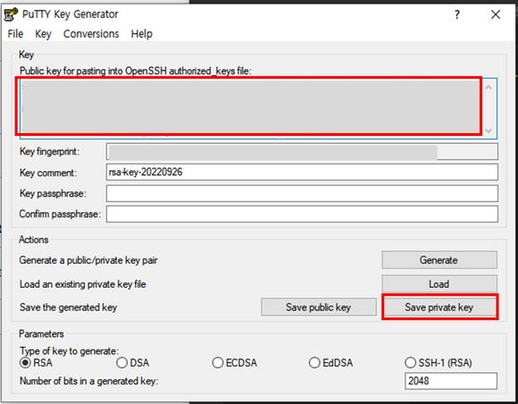 
        

1. **Firewall rule for ZCM**
    
    For ZCM migration, you need to prepare VPC firewall rules. 
    
    When you add VM Info from ZConverter console, you can create a new firewall rule. Copy and paste the following values in `firewall_rule` field:
    
    ```bash
    tcp:22,tcp:3389,tcp:111,tcp:139,tcp:443,tcp:445,tcp:2049,tcp:3000,tcp:3306,tcp:80,tcp:4001,tcp:5001,tcp:9051-9054,tcp:50000-50005,tcp:53306,udp:9051-9054
    ```
    

## 4-2. VM Info Fields

1. ****Credentials File [ .json ]**** *essential
    
    A service account credentials file (.json).
    
2. ****Region [ Zone ]**** *essential
    
    A region which specifies the zone in which you want to create the VM.
    
3. ****VM Name**** *essential
    
    A name of the VM. Name must be unique to the project. For more information, see: [**Naming Resources**](https://cloud.google.com/compute/docs/naming-resources)
    
    ```bash
    Match the regular expression ^[a-z]([-a-z0-9]*[a-z0-9])?. 
    This means that the first character must be a lowercase letter, and all the following characters must be hyphens, lowercase English letters, or digits, except the last character, which cannot be a hyphen.
    ```
    
4. ****Machine Type [ Shape ]**** *essential
    
    The machine type used for the VM.
    
5. ****OS**** *essential
    
    An image project of Operating System used for the VM 
    
6. ****OS_version**** *essential
    
    A image family of the selected image project used for theVM 
    
7. ****User name**** *optional
    
    A username of OS login to connect VMs.
    
    ```
    For Linux VMs, the username can’t be root. For Windows VMs, the username can’t be Administrator.
    ```
    
8. ****SSH Authorized Keys [ .pub ]**** *optional
    
    A public key of the SSH key pair to access the VM. The key must use `public-openssh` format. For windows VM, not required. For more information, see **[Add SSH keys to VMs](https://cloud.google.com/compute/docs/connect/add-ssh-keys#gcloud_1)**
    
9. ****Volume**** *optional
    
    List of the sizes of additional persistent disks. If you want to attach one or more disks to the VM, list sizes with comma(,). Size must be between 10 ~ 65,536 GB, a multiple number of 1 GB. These persistent disks are automatically deleted when the VM is deleted.  
    
    - If you create one or more additional disks for Windows VM, the first disk is created from same version image of VM’s OS, and other disks are blank disks.
        
        
        | OS image | Disk image |
        | --- | --- |
        | windows-2012-r2 | windows-server-2012-r2-dc-v20220712 |
        | windows-2016 | windows-server-2016-dc-v20220713 |
        | windows-2019 | windows-server-2019-dc-v20220712 |
        | windows-2022 | windows-server-2022-dc-v20220712 |
        |  |  |
    
    ```
    Ex)  Attach two persistent disks (50GB) to VM
    		50,50
    ```
    
10. ****User data [ .sh | .ps1 ]**** *optional
    
    An user data that run when the instance boots. On Linux VMs,  use bash file (.sh). On Windows VMs, use powershell file (.ps1).
    
11. ****tags**** *optional
    
    Target tag of the firewall rules. The firewall rule applies only to instances with this tags. The tags must be unique to the project. If there is no firewall rules with same name as this value and `firewall_rule` field is specified, a new firewall rule is automatically created in the default network. 
    
12. ****firewall_rule**** *optional
    
    Lst of protocols and destination ports to allow inbound rules. When you create a new firewall rule, specify both this and tags fields. For more information about firewall rule, see: **[VPC Firewall Rules Overview](https://cloud.google.com/vpc/docs/firewalls#direction_of_the_rule)**
    
    ```bash
    ex) create rules to allow TCP 4001, 5001 port incoming connections
    		tcp:4001,tcp:5001 
    ```
    

---

# 5. NCP

## 5-1. Prerequisites

1. **Authorizing for CLI**
    
    To authorize Naver Cloud CLI, you need Access key, Secret Access key. For more information, see: [Authentication key management](https://guide.ncloud-docs.com/docs/en/userguide-userguideaccount-5#%EC%9D%B8%EC%A6%9D%ED%82%A4-%EA%B4%80%EB%A6%AC)
    
    1. Go to **My Page > Manage account > Manage authentication key** page in Naver Cloud console.  
    2. Click `Create new API authentication key` to create a new API key. 
    3. Copy and save the values of Access key and Secret key.   
        
        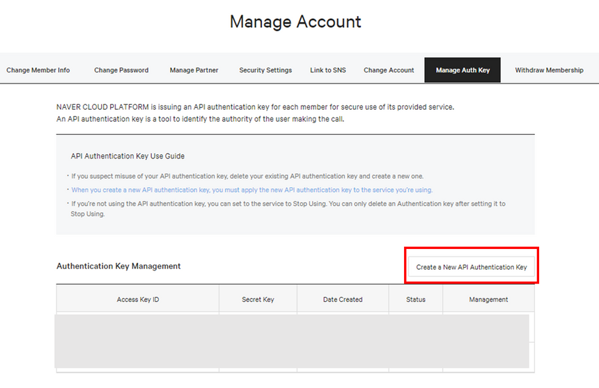 
        
    
2. **Authentication key** 
    
    An admin password is required to access VMs. The authentication key is used to get the admin password.   
    
    1. Go to **Sevicecs > Compute > Server** page on VPC environment in Naver Cloud console.
    2. Click `Create server`.
        
        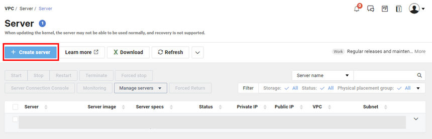 
        
    3. Specify sever image and other setting and click `Next`.
    4. Click `Create a new authentication key` and enter the name. 
    5. Click `Create and save authentication key`. Then, the key will be downloaded to your local system.
        
        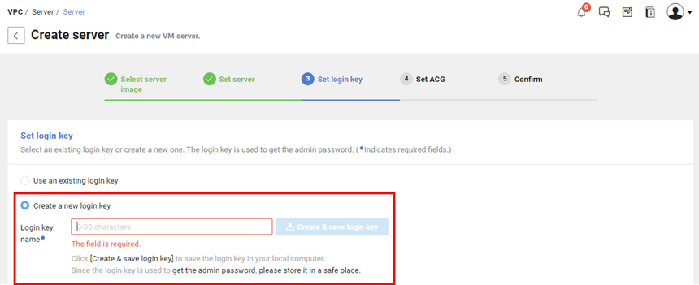 
        

1. **Subnet and Network ACL rules for ZCM**
    
    For ZCM migration, you need to prepare a Network ACL in the specified VPC. For more informatino, see: [Network ACL](https://guide.ncloud-docs.com/docs/en/network-acl), [Subnet Management](https://guide.ncloud-docs.com/docs/en/vpc-subnetmanage-vpc)
    
    **[ Network ACL rules ]**
    
    1. Go to **Services > Networking > VPC** page on VPC environment in Naver Cloud console.
    2. Go to **Network ACL > ACL rule** menu.
    3. Choose an existing network ACL on the list or create a new one by clicking `Create Network ACL`.
        1. (optional) If  `Create Nework ACL` pop-up windows apears, specify Network ACL Name, and then select a VPC to apply.
        2. Click `Create`. 
    4. Set network ACL rules:
        1. Click `Rule setting`.
        2. Add inbound rules as follows:
            - Priority: Enter a number between 0 and 199. It have to be unique.
            
            ```
            [
                {
                    "Protocol": "tcp",
                    "Port": 22,
                    "Access Source": "218.145.116.162/32"
                },
                {
                    "Protocol": "tcp",
                    "Port": 3389,
                    "Access Source": "218.145.116.162/32"
                },
                {
                    "Protocol": "tcp",
                    "Port": 3306,
                    "Access Source": "218.145.116.162/32"
                },
                {
                    "Protocol": "tcp",
                    "Port": 80,
                    "Access Source": "0.0.0.0/0"
                },
                {
                    "Protocol": "tcp",
                    "Port": 111,
                    "Access Source": "0.0.0.0/0"
                },
                {
                    "Protocol": "tcp",
                    "Port": 139,
                    "Access Source": "0.0.0.0/0"
                },
                {
                    "Protocol": "tcp",
                    "Port": 443-445,
                    "Access Source": "0.0.0.0/0"
                },
                {
                    "Protocol": "tcp",
                    "Port": 2049,
                    "Access Source": "0.0.0.0/0"
                },
                {
                    "Protocol": "tcp",
                    "Port": 3000,
                    "Access Source": "0.0.0.0/0"
                },
                {
                    "Protocol": "tcp",
                    "Port": 4001,
                    "Access Source": "0.0.0.0/0"
                },
                {
                    "Protocol": "tcp",
                    "Port": 5001-5005,
                    "Access Source": "0.0.0.0/0"
                },
                {
                    "Protocol": "tcp",
                    "Port": 9051-9054,
                    "Access Source": "0.0.0.0/0"
                },
                {
                    "Protocol": "tcp",
                    "Port": 50000-50005,
                    "Access Source": "0.0.0.0/0"
                },
                {
                    "Protocol": "tcp",
                    "Port": 53306,
                    "Access Source": "0.0.0.0/0"
                },
                {
                    "Protocol": "icmp",
                    "Access Source": "0.0.0.0/0"
                }
            ]
            ```
            
    5. Click `Apply`. 
    
    **[ Subnet ]**
    
    1. Go to **Services > Networking > VPC** page on VPC environment in Naver Cloud console.
    2. Go to **Subnet Management** menu.
    3. Create a subnet:
        1. Click `Create Subnet`.
        2. Specify information for the subnet. Select **Public** for the **Internet Gateway Only** field. 
        3. Select the Network ACL that you created for ZCM migration in the previous step.
        4. Click `Create`.   
        
            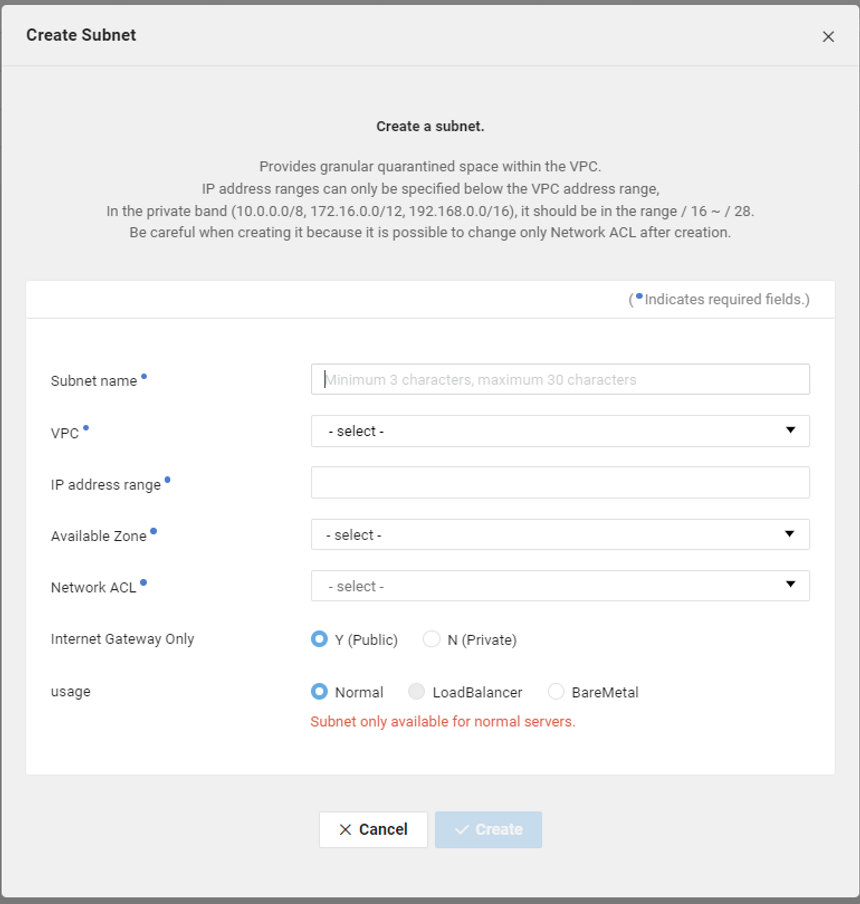 
        
    
     
    
2. **Init script**
    
    Init scripts run automatically when the VM is created. For more information, see: [Init script for Server](https://guide-gov.ncloud-docs.com/docs/compute-compute-8-1-vpc)
    
    1. Go to **Sevices > Compute > Sever > Init Script** page on VPC environment in Naver Cloud console. 
    2. Click `Create script` to register a new one.  
    3. Enter Script name, OS type, Scripts.
        
        ```bash
        For Linux VM, You can use scripts such as Python, Perl and Shell. You need to specify the path of your script at the beginning of the script, as follow:
        		#!/usr/bin/env python, #!/bin/perl, #!/bin/bash
        For Windows VM, only Visual Basic script is available. 
        Scripts should be written only in English.
        ```
        
        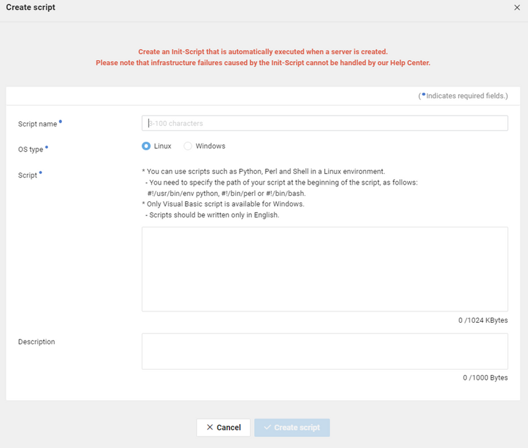 
        
    4. Click `Create script`.  

## 5-2. VM Info Fields

1. Profile  *essential
    
    A profile for your credential information about Naver Cloud CLI. Allowed characters are letter, number, under bar(_), hypen(-). 
    
2. Access key  *essential
    
    The ID of access key you created in Naver Cloud console.  
    
3. Secret access key  *essential
    
    The secret key of the access key you created in Naver Cloud console. 
    
4. Region (Zone)  *essential
    
    A region in which you want to create the VM. 
    
5. VM Name  *essential
    
    A name of the VM. Name must be unique. 
    
    ```
    The value should be 3 to 30 characters in English letters, numbers, and hyphens (-).
    The first chracter must be a lowercase letter, and the last character must be a letter or number.  
    ```
    
6. OS  *essential
    
    The Operating System used for the VM. 
    
7. OS Version  *essential
    
    The version of Operating System used for the VM.  
    
8. Cpu count *essential
    
    A number of CPUs used for the VM. 
    
9. Memory size  *essential
    
    A size of memory used for the VM.  
    
10. Login key [.pem] *optional
    
    An authentication key file to access the VM. You can create it in Naver Cloud console. 
    
11. Subnet ID *essential
    
    A subnet ID used for the VM. You can create or modify a Subnet in Naver Cloud console. 
    
12. Volume *optional
    
    List of the sizes for block volumes. If you want to attach one or more volumes to the VM, list sizes with comma(,). Size must be between 10 ~ 2,000 GB, a multiple number of 10 GB. These block volumes are automatically deleted when the VM is terminated. 
    
    ```bash
    Ex)  Attach two additional disks (20GB) to VM
    		20,20
    ```
    
13. User data *optional
    
    A name of the init script that run when the instance boots. You can import a new one in Naver Cloud console. For more information, see: [Init script for Server](https://guide-gov.ncloud-docs.com/docs/compute-compute-8-1-vpc)
    

---

# Userdata for ZCM Source and Target

The user data is script for automatically installing ZCM source and target agent on VMs. You can download userdata files from [here](https://www.zconverter.com/zm/scripts/).

Download a proper userdata depending on the platform on which the VM was created and whether VM was Source or Target. 

> `PLATFORM`-`AGENT`-`OS`.sh
> 
- `PLATFORM` : one of aws / azure / gcp / oci
- `AGENT` : one of source / target
- `OS` : one of cent / ubuntu

```
ex) userdata for CentOS 7 Target VM on GCP
	gcp-target-cent.sh
```

### Example**: azure-source-cent.sh**

```bash
#!/bin/bash
########### script for Install zcm source package / CentOS ###########

## var ##
ZCM_IP=52.231.158.93                                                    # << IP Address for Download ZCM Source Agent install file
Main_Address="http://121.134.103.21:1000"
USER=admin@zconverter.com                                               # << User for Installing ZCM Source Agent
AGENT=ZConverter_CloudSourceClient_Setup_V3.5_Build_3093.tar.gz         # << ZCM Source Agent Install file name
#########

## Setting Root password ##
echo 'root:zconp@ssw0rd' | sudo chpasswd                                                    
sudo sed -i 's/#PermitRootLogin yes/PermitRootLogin yes/' /etc/ssh/sshd_config              
sudo sed -i 's/PasswordAuthentication no/PasswordAuthentication yes/g' /etc/ssh/sshd_config 
systemctl restart sshd                                                                      
##

## Preinstallation zcm source package ##
echo install wget ... >> /tmp/package_install.log
sudo yum install wget -y &>> /tmp/package_install.log
echo wget install done! >> /tmp/package_install.log
##

#######################################################
########### Install zcm source agent ###########

wget -P /tmp/ --tries=200 http://${ZCM_IP}/Download/${AGENT} --no-check-certificate >> /tmp/wget.log
tar zxvf /tmp/${AGENT} -C /tmp
/tmp/zconverter_install_source/install.sh default2 ${ZCM_IP} ${USER} >> /tmp/install_source.log

#######################################################
########### Get vm Info / CentOS ###########

echo >> /tmp/info.sh
echo "################################ System Information###############################" >> /tmp/info.sh
dmidecode -t system | grep -E "System Information|Manufacturer|Product" >> /tmp/info.sh
echo >> /tmp/info.sh
virt-what >> /tmp/info.sh
echo >> /tmp/info.sh
uname -a >> /tmp/info.sh
echo >> /tmp/info.sh
cat /etc/os-release | grep -E "PRETTY_NAME" >> /tmp/info.sh
echo >> /tmp/info.sh
hostname >> /tmp/info.sh
echo >> /tmp/info.sh
df -h >> /tmp/info.sh

#######################################################
########### Install Azure default web package / CentOS ###########

## var ##
PACKAGE_NAME=azure.tar.gz                                               # << Azure web package name  
#########

## Preinstallation web package ##
echo install httpd ... >> /tmp/package_install.log
yum install httpd -y &>> /tmp/package_install.log
systemctl enable httpd
echo httpd install done! >> /tmp/package_install.log
##

## Download Web package ## 
echo download web... >> /tmp/package_install.log
wget -P /tmp/ --tries=200 http://${ZCM_IP}/Download/defaultWeb/${PACKAGE_NAME} --no-check-certificate >> /tmp/wget.log
tar zxvf /tmp/${PACKAGE_NAME} -C /var/www/
echo download web default package done! >> /tmp/package_install.log

systemctl restart httpd
systemctl stop firewalld && systemctl disable firewalld
#######################################################
```

### Example: azure-target-cent.sh

```bash
#!/bin/bash
########### script for Install zcm target package / CentOS ###########

## var ##
ZCM_IP=52.231.158.93                                                   # << IP Address for Download ZCM Target Agent install file
Main_Address="http://121.134.103.21:1000"
USER=admin@zconverter.com                                              # << User for Installing ZCM Target Agent
AGENT=ZConverter_CloudTargetClient_Setup_V3.5_Build_3093.tar.gz        # << ZCM Target Agent Install file name
#########

## Setting Root password ##
echo 'root:zconp@ssw0rd' | sudo chpasswd
sudo sed -i 's/#PermitRootLogin yes/PermitRootLogin yes/' /etc/ssh/sshd_config
sudo sed -i 's/PasswordAuthentication no/PasswordAuthentication yes/g' /etc/ssh/sshd_config
systemctl restart sshd
## 

## Preinstallation ZCM target package ##
echo install wget ... >> /tmp/package_install.log
sudo yum install wget -y &>> /tmp/package_install.log
echo wget install done! >> /tmp/package_install.log
##

#######################################################
########### Install ZCM target agent ###########

wget -P /tmp/ --tries=200 http://${ZCM_IP}/Download/${AGENT} --no-check-certificate >> /tmp/wget.log
tar zxvf /tmp/${AGENT} -C /tmp
/tmp/zconverter_install_target/install.sh default2 ${ZCM_IP} ${USER} >> /tmp/install_target.log

#######################################################
```

---

# Step by Step about Migration source to target VM

### AWS Source VM

- **Profile**
    
    Use default value
    
- **Access Key & Secret Access Key & Login Region**
    
    Use default value
    
    ```
    You can use your access key and secret access key created in AWS console. 
    ```
    
- **Region**
    
    Use default value
    
- **OS & OS_version**
    
    Select **CentOS , 7**
    
    ```
    Select OS and OS_version for VM.
    ```
    
- **VM Name**
    
    ```bash
    Specify the name of VM.
    ```
    
- **Image**
    
    Select ****ami-09e2a570cb404b37e (CentOS-7-2111-20220825_1.x86_64-d9a3032a-921c-4c6d-b150-bde168105e42)****
    
    ```bash
    Select an AMI image on the toggle list for VM.
    If you select the AMI of AWS marketplace, you must subscribe to the image in AWS console before using it. 
    ```
    
- **Instance Type**
    
    Use default value
    
    ```
    Select a Instance type for VM.
    ```
    
- **CPU Count & Memory Size**
    
    Use default value
    
    ```
    Select CPU Count for VM.
    ```
    
- **Security Group Id**
    
    After deselect `Automatically create a new security group` option, select **sg-073eb02b16e13cb17 (zcon-demo)**
    
    ```
    If you select the "Automatically create a new security group" option, You can create a new security group for ZCM migration.
    For more information, see "Prerequisites and VM Info by Cloud platform - AWS" section. 
    ```
    
- ****Login Key [ .pem ]****
    
    Upload **aws_demo_key.pem** file
    
    ```
    You can use a public SSH key of your key pair imported in AWS console. 
    ```
    
- **Volume**
    
    Use default value
    
    ```bash
    If you want to attach one or more additional disks to the VM, list sizes with comma(,).
    ```
    
- **User data** ****[ .sh / .ps1 ]****
    
    Upload **aws-source-userdata.sh** file
    

### AWS Target VM

- **Profile**
    
    Use default value
    
- **Access Key & Secret Access Key & Login Region**
    
    Use default value
    
    ```
    You can use your access key and secret access key created in AWS console. 
    ```
    
- **Region**
    
    Use default value
    
- **OS & OS_version**
    
    Select **CentOS , 7**
    
    ```
    Select OS and OS_version for VM.
    ```
    
- **VM Name**
    
    ```bash
    Specify the name of VM.
    ```
    
- **Image**
    
    Select ****ami-09e2a570cb404b37e (CentOS-7-2111-20220825_1.x86_64-d9a3032a-921c-4c6d-b150-bde168105e42)****
    
    ```
    Select an AMI image on the toggle list for VM.
    If you select the AMI of AWS marketplace, you must subscribe to the image in AWS console before using it. 
    ```
    
- **Instance Type**
    
    Use default value
    
    ```
    Select a instance type for VM.
    ```
    
- **CPU Count & Memory Size**
    
    Use default value
    
    ```
    Specify CPU Count and Memory Size for VM.
    ```
    
- **Security Group Id**
    
    After deselect `Automatically create a new security group` option, select **sg-073eb02b16e13cb17 (zcon-demo)**
    
    ```
    If you select the "Automatically create a new security group" option, You can create a new security group for ZCM migration.
    For more informatino, see "Prerequisites and VM Info by Cloud platform - AWS" section. 
    ```
    
- ****Login Key [ .pem ]****
    
    Upload **aws_demo_key.pem** file
    
    ```
    You can use a public SSH key of your key pair imported in AWS console. 
    ```
    
- **Volume**
    
    Insert **50**
    
    ```bash
    If you want to attach one or more additional disks to the VM, list sizes with comma(,).
    Target VM need at least an additional disk. The disk size must be at least 50GB
    ```
    
- **User data** ****[ .sh / .ps1 ]****
    
    Upload **aws-target-userdata.sh** file
    

### **Azure Source VM**

- **Subscription ID & Tenant ID & App ID & App PWD**
    
    Use default value 
    
    ```
    You can use your Subscription ID, Tenant ID, App ID and Password created in Azure console.
    ```
    
- **Region**
    
    Use default value
    
- **VM Name**
    
    ```
    Specify the name of VM.
    ```
    
- **Machine Type**
    
    Select **Standard_A1_v2**
    
    ```
    Select a machine type for VM.
    Creating VM may not work normally because of the limit of resources for the specified region where you want to create the VM.
    Therefore, select the machine type after checking the usage ammount for the region, or change the region.
    ```
    
- **OS & OS_version**
    
    Select **CentOS , 7.6**
    
    ```
    Select OS and OS_version for VM.
    ```
    
- **Volume**
    
    Use default value
    
    ```bash
    If you want to attach one or more additional disks tot the VM, list sizes with comma(,).
    ```
    
- ****Username (Login ID) & Password (Login Password)****
    
    Use default value
    
    ```bash
    Username only contains English letters, numbers, hyphens, and underscores and may not start with a hyphen or number. The value must be between 1 ~ 64 characters long. 
    Usernames must not include reserved words. (ex) test, root, admin, ...) 
    Password must have 3 of the following: 1 lowercase character, 1 uppercase character, 1 number and 1 special character. The value must be between 12 ~ 72 characters long.
    ```
    
- ****User data [ .sh / .ps1 ]****
    
    Upload **azure-source-userdata.sh** file
    

### **Azure Target VM**

- **Subscription ID & Tenant ID & App ID & App PWD**
    
    Use default value 
    
    ```
    You can use your Subscription ID, Tenant ID, App ID and password created in Azure console.
    ```
    
- **Region**
    
    Use default value
    
- **VM Name**
    
    ```
    Specify the name of VM.
    ```
    
- **Machine Type & CPU Count & Memory Size**
    
    Select **Standard_A1_v2**
    
    ```
    Select a machine type for VM.
    Creating a VM may not work normally because of the limit of resources for the specified region where you want to create the VM.
    Therefore, select the machine type after checking the usage ammount for the region, or change the region.
    ```
    
- **OS & OS_version**
    
    Select **CentOS , 7.6**
    
    ```
    Select a Machine type for VM.
    ```
    
- **Volume**
    
    Insert **50**
    
    ```bash
    If you want to attach one or more additional disks, specify sizes of disks.
    Target VM need at least an additional disk. The disk size must be at least 50GB
    ```
    
- ****Username (Login ID) & Password (Login Password)****
    
    Use default value
    
    ```bash
    Username only contains English letters, numbers, hyphens, and underscores and may not start with a hyphen or number. The value must be between 1 ~ 64 characters long. 
    Usernames must not include reserved words. (ex) test, root, admin, ...) 
    Password must have 3 of the following: 1 lowercase character, 1 uppercase character, 1 number and 1 special character. The value must be between 12 ~ 72 characters long.
    ```
    
- ****User data [ .sh / .ps1 ]****
    
    Upload **azure-target-userdata.sh** file
    

### **GCP Source VM**

- ****Credentials File [ .json ]****
    
    Upload **gcp_credentials.json** file
    
    ```
    You can use your service account credentials created in Google Cloud console. 
    ```
    
- **Region [Zone]**
    
    Use default value
    
- **VM Name**
    
    ```bash
    Specify the name of VM.
    ```
    
- ****Machine Type [ Shape ]****
    
    Use default value
    
    ```
    Select a Machine type for VM.
    ```
    
- **OS & OS_version**
    
    Select **centos-cloud , centos-7**
    
    ```
    Select OS and OS_version for VM.
    ```
    
- **User name**
    
    ```
    Specify username for OS login. Username can't be "root", "Administrator".
    ```
    
- **SSH Authorized Keys [ .pub ]**
    
    Upload **oci_gcp_demo_key.pub** file
    
    ```bash
    You can use a public key of your SSH key pair. The key must use the public-openssh format
    (ex) ssh-rsa AAAAB3Nza…… )
    ```
    
- **Volume**
    
    Use default value
    
    ```bash
    If you want to attach one or more pesistent disks to the VM, list sizes with comma(,).
    ```
    
- ****User data [ .sh / .ps1 ]****
    
    Upload **gcp-source-userdata.sh** file
    
- **tags**
    
    Use **demo**
    
- **firewall_rule**
    
    ```
    If you want to create a new firewll rule, specify "tags" and "firewall_rule" field. 
    (ex) create a firewall rule to allow tcp 4001, 5001 port incomming connection, with “test” target tag
    		tags : “test”
    		firewall_rule : “tcp:4001,tcp:5001”
    ```
    

### **GCP Target VM**

- ****Credentials File [ .json ]****
    
    Upload **gcp_credentials.json** file
    
    ```
    You can use your service account credentials created in Google Cloud console. 
    ```
    
- **Region [Zone]**
    
    Use default value
    
- **VM Name**
    
    ```bash
    Specify the name of VM.
    ```
    
- ****Machine Type [ Shape ]****
    
    Use default value
    
    ```
    Select a Machine type for VM.
    ```
    
- **OS & OS_version**
    
    Select **centos-cloud , centos-7**
    
    ```
    Select OS and OS_version for VM.
    ```
    
- **User name**
    
    ```
    Specify username for OS login. Username can't be "root", "Administrator".
    ```
    
- **SSH Authorized Keys [ .pub ]**
    
    Upload **oci_gcp_demo_key.pub** file
    
    ```bash
    You can use a public key of your SSH key pair. The key must use the public-openssh format
    (ex) ssh-rsa AAAAB3Nza…… )
    ```
    
- **Volume**
    
    Insert **50** 
    
    ```bash
    If you want to attach one or more pesistent disks to the VM, list sizes with comma(,).
    Target VM need at least an pesistent disk. The disk size must be at least 50GB
    ```
    
- ****User data [ .sh / .ps1 ]****
    
    Upload **gcp-target-userdata.sh** file
    
- **tags**
    
    Insert **demo**
    
- **firewall_rule**
    
    ```
    If you want to create a new firewll rule, specify "tags" and "firewall_rule" field. 
    (ex) create a firewall rule to allow tcp 4001, 5001 port incomming connection, with “test” target tag
    		tags : “test”
    		firewall_rule : “tcp:4001,tcp:5001”
    ```
    

### **OCI Source VM**

- ****Credentials File Upload [ Config File ]****
    
    Upload **oci_config** file 
    
- ****Config Key File [ .pem ]****
    
    Upload **oci_config.pem** file 
    
    ```bash
    You can use your config and config key file (.pem) created in Oracle Cloud console.
    ```
    
- **Compartment Id**
    
    Use default value
    
- **Available Domain**
    
    Use default value
    
- **VM Name**
    
    ```bash
    Specify the name of VM.
    ```
    
- **Profile**
    
    Insert the profile in your config file  
    
    ```bash
    Example of Config file)
    [DEFAULT] // ← profile
    user=*****************
    fingerprint=*****************
    tenancy=*****************
    region=*****************
    key_file=*****************
    ```
    
- ****Machine Type [ Shape ]****
    
    Use default value
    
    ```
    Select a Machine type for VM.
    ```
    
- **CPU Count & Memory Size**
    
    Use default value
    
    ```
    Specify CPU Count and Memory Size for VM.
    ```
    
- **OS & OS_version**
    
    Select **CentOS , 7** 
    
    ```
    Select OS and OS_version for VM.
    ```
    
- **Subnet ID**
    
    After deselect `Automatically create a new subnet` , select **subnet-20210421-1418 (ocid1.subnet.oc1.ap-seoul-1.aaaaaaaaikxwifqksivdvnvl27k6mffo7cnvqv4xhw4rvcgjnc7yc7ydkc2q)**
    
    ```
    If you select the "Automatically create a new subnet" option, You can create a new subnet for ZCM migration.
    For more informatino, see "Prerequisites and VM Info by Cloud platform - OCI" section. 
    ```
    
- **Volume**
    
    Use default value
    
    ```
    If you want to attach one or more additional disks to the VM, list sizes with comma(,).
    ```
    
- **Login Key [ .pub ]**
    
    Upload **oci_gcp_demo_key.pub** file
    
    ```bash
    You can use a public key of your SSH key pair. The key must use the RSA format
    ```
    
- ****User data [ .sh / .ps1 ]****
    
    Upload **oci-source-userdata.sh** file
    

### **OCI Target VM**

- ****Credentials File Upload [ Config File ]****
    
    Upload **oci_config** file 
    
- ****Config Key File [ .pem ]****
    
    Upload **oci_config.pem** file 
    
    ```bash
    You can use your config and config key file (.pem) created in Oracle Cloud console.
    ```
    
- **Compartment Id**
    
    Use default value
    
- **Available Domain**
    
    Use default value
    
- **VM Name**
    
    ```bash
    Specify the name of VM.
    ```
    
- **Profile**
    
    Insert the profile in your config file  
    
    ```bash
    Example of Config file)
    [DEFAULT] // ← profile
    user=*****************
    fingerprint=*****************
    tenancy=*****************
    region=*****************
    key_file=*****************
    ```
    
- ****Machine Type [ Shape ]****
    
    Use default value
    
    ```
    Select a Machine type for VM.
    ```
    
- **CPU Count & Memory Size**
    
    Use default value
    
    ```
    Specify CPU Count and Memory Size for VM.
    ```
    
- **OS & OS_version**
    
    Select **CentOS , 7** 
    
    ```
    Select OS and OS_version for VM.
    ```
    
- **Subnet ID**
    
    After deselect `Automatically create a new subnet` , select **subnet-20210421-1418 (ocid1.subnet.oc1.ap-seoul-1.aaaaaaaaikxwifqksivdvnvl27k6mffo7cnvqv4xhw4rvcgjnc7yc7ydkc2q)**
    
    ```
    If you select the "Automatically create a new subnet" option, You can create a new subnet for ZCM migration.
    For more informatino, see "Prerequisites and VM Info by Cloud platform - OCI" section. 
    ```
    
- **Volume**
    
    Insert **50**
    
    ```bash
    If you want to attach one or more additional disks to the VM, list sizes with comma(,).
    Target VM need at least an pesistent disk. The disk size must be at least 50GB
    ```
    
- ****Login Key [ .pub ]****
    
    Upload **oci_gcp_demo_key.pub** file
    
    ```bash
    You can use a public key of your SSH key pair. The key must use the RSA format
    ```
    
- ****User data [ .sh / .ps1 ]****
    
    Upload **oci-target-userdata.sh** file